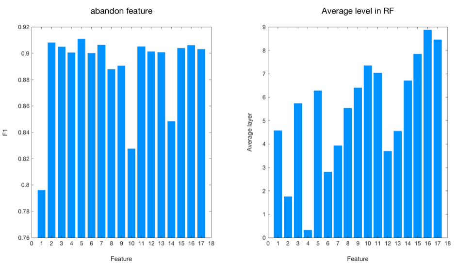

# 中山大学数据科学与计算机学院

## 软件工程（移动信息工程专业） 

## 《人工智能》专业选修课 

## 本科生项目报告

（2017-2018学年秋季学期）

**课程名称：Artificial Intelligence**
**教学班级： 周五5-6**

| 组号   | 学号       | 专业（方向）       | 组名   | 姓名   |
| ---- | -------- | ------------ | ---- | ---- |
| 58   | 15352285 | 软件工程（移动信息工程） | 没有区别 | 任磊达  |

## Project最终结果展示

### 最终结果

|          | 二元分类      | 多元分类       | 回归        |
| -------- | --------- | ---------- | --------- |
| 最好结果     | 0.9187755 | 0.60575898 | 47.981198 |
| 排名(最好排名) | 8(1)      | 27(1)      | 4(3)      |

### 组内分工

| 组员   | Task1             | Task2                               | Task3             |
| ---- | ----------------- | ----------------------------------- | ----------------- |
| 檀祖冰  | KNN，**ZBNN实现**与调参 | 数据集分析及算法分析                          | **数据预处理，NN实现与调参** |
| 任磊达  | 数据预处理，随机森林实现      | **NB+Adaboost实现与优化**，KNN+NB，NB分布式实现 | **NN数据与处理**       |


### 个人工作

1. 第一周：第一题数据预处理，重构决策树。实现NB+Adaboost完成第二题。
2. 第二周：调优NB+Adaboost，使用NN进行Task3缺失值补全。
3. Pre周：参与Task1，3调参，但是结果上没有实质性进展。
4. 第四周：使用随机森林对于Task1数据预处理。
5. 最后一周：重构NB+Adaboost，准确率上0.6。

## 工作流程

### 算法简介

#### 数据集效果

##### Task1 二元分类（F1值）

| Task1             | F1     |
| ----------------- | ------ |
| 决策树               | 0.72   |
| （参与）感知机（ZBNN）     | 0.85   |
| 随机森林              | 0.73   |
| （参与）随机森林+KNN(k=1) | **91** |

##### Task2 多元分类（准确率）

| Task2                 | 准确率       |
| --------------------- | --------- |
| NB                    | 42%       |
| KNN                   | 40%       |
| KNN+NB                | 39%       |
| Adaboost              | **60.5%** |
| **Parellel Adaboost** | 58%       |

| 分类器               | 参数                                      |
| ----------------- | --------------------------------------- |
| Adaboost          | classifier number=200,sampleRate=0.2    |
| Parellel Adaboost | classifier number=28,sampleRate=0.23333 |


##### Task3 回归(RMSE)

| Task3           | RMSE in train | RMSE in validation   |
| --------------- | ------------- | -------------------- |
| KNN             | (k=1,0)       | 140                  |
| Naive MLP       | 175           | 180（higher than 1NN) |
| **Divided MLP** | **8**         | **85**               |

#### Parallel Adaboost

Adaboost原始算法是在原始数据集上采样，而后使用分类结果对于这一部分数据集在全局上面的权重进行更新，而后依据每一个分类器训练集上的错误率，使用每一个分类器的加权求和得到结果；但是这样的方法会让之后迭代生成的分类器明显优于之前的分类器（因为训练集上权值分布已经被改变），那为何不让每个子分类器**都处于最优状态**呢？于是我提出一个并行Adaboost的方法，具体流程如下：

```flow
st=>start: 确定采样率，迭代次数N,分类器个数
p1=>operation: 对于每个分类器采样
p2=>operation: 对于每个分类器迭代N次，记录最优权值
p3=>operation: 恢复每个分类器最优权值
e=>end: 加权得到分类结果
st->p1->p2->p3->e
```

也就是说，对于每个分类器进行了多次的权值重分布，与常规Adaboost不同的地方在于：更新权值过程不是对于全局的权值，与[1]不同的是，可以不更新正确分类样本的权值，另外这样可以在生成每个分类器之后直接进行并行优化，训练迭代完成之后再进行组合即可。这样的算法比常规Adaboost有更好的并行性能，另外对于**数据集原始分布**有更好的感知。

#### 辅助手段(数据预处理)

1. 对于二元分类任务的数据我们尝试**上采样**部分特征来提高模型的表现效果，当我们将第一列特征上采样1.9-2.1倍的时候，在验证集F1值第一次突破了0.91。也就是说对于数据的上采样可能通过暴力枚举每个特征的方式直接地体现特征的重要性。当然更为直接的下采样也能调整数据特征对于模型的影响程度，如图左所示，下采样第一列，第10列和第15列特征去掉之后对于结果影响较大，说明这些特征较为重要。

2. 对于二元分类任务，由于没有给出特征定义，我们使用随机森林来提取特征的重要性：具体而言是统计每一个特征在森林中的**平均**层数（图右所示），由于决策树的划分依据是熵减最大原则，那么越为重要的特征理论上平均层数应该越大，因此我们剔除了平均层数最高的16#特征，对于训练集预测效果有显著改善。与采样方法不同的地方在于随机森林可以通过设置阈值的方式更快更科学的**剔除多个无用特征**。

   

3. 对于三元分类任务，我使用C语言自定义数据读取方式，而后使用**BKD Hash**算法对于6w个左右词组进行Hash编码，并使用unordered_map进行二度Hash存储，大幅提高了读取数据的速度（7s），大幅降低了内存存储的复杂度（1.2G）也对于整体数据分析提供了基本保障，发现实际上三元分类任务中，对于数据集使用的一些Trick并没有改善模型准确率，其中包括但不限于：

   - 手动设置和导入了一些停用词表，如主语，系动词等
   - 针对`hhhhhh`，`hhhhhhh`这样的单词进行定长补全和限制长度
   - 利用`<sssss>`得到的句子补全上一个样本遗留的句子
   - 利用2-gram和3-gram生成词组特征

4. 对于回归任务，由于数据集中存在大量的离散值和连续值，我使用不同的策略补全离散值和连续值：由于KNN泛化能力不错，神经网络有良好的回归拟合能力，我使用KNN补全离散值，使用MLP补全离散值：具体方法是使用完整数据作为训练集进行建模，而后使用输出补全。

5. 对于回归任务，我对于数据集使用了一些Trick，显著地提高了模型对于数据的拟合程度（但是泛化能力没有提高）：

   - 由于数据集中Tick是相邻的，在每一个数据中加入前一个Tick和后一个Tick作为特征进行优化，对于首末数据加入自己本身。
   - 对于数据集中的连续值，依据在训练集上的“密度”进行10等分，作为特征加入模型进行训练，模型再训练集上的拟合程度可以降低至个位数。

### 调参过程（Task2）

对于Task2两种主要模型进行调参的详细记录：

```python
# parallel adaboost: 
# version: classifier number * iteration number   accuracy
# D(default=3) is classifier depended sample rate that 
# sample rate = D / classifier number
v1: 100 * 20,  			0.288107169445513
v2: 10 * 20, 		 	0.546718341018424
v3: 20 * 10, 			0.5555090817823397
v4: 10 * 10,			0.550517006239672
v5: 5 * 20         		0.4855181383738934
v6: 30 * 10				0.33352586324526273
v7: 15 * 20				0.5501997478694906
v8: 25 * 20, D = 5		0.5586696549861038 [best]
v9: 100 * 5, D = 10		0.5450289497790275
v10:100 * 10,D = 20		0.5282571258949551
# adaboost
# version: classifier number * sample rate [validation accuracy][test accuracy]
V1: 100*0.5[validation:0.557035][0.509053473434]
V2: 200*0.3[val:60.04][0.563148403937]
V3: 200*0.2[val:61.19][0.6000920808]
V4: 128*0.2[val:61.5][0.605758981391][best]
V5: 128*0.22[val:0.611182][0.429400495731]
V6: 128*0.19[val:0.602][0.58719716508]
V7: 100*0.5[val:0.606209][0.585601372157]
V8: 100*0.3[val:0.606209][0.585601372157]
V9: 100*0.2[val:0.606209][0.585601372157]
V10:128*0.3[val: 0.606209][0.585601372157]
```

- 调参的基本出发点是确定参数对于模型优化的上下界以及基本相关性，也就是随机尝试多个参数之后开始使用约估出来的较好的参数范围手动搜索：如在第二题调参过程中，我尝试了0.3和0.7两个采样率发现0.3的明显好过0.7的，于是尝试0.2和0.5这两个参数。由于学习代码运行时间较长，并且**没有**明显的参数凸函数性质，故不适合用牛顿迭代法，最速下降法，三分法等手段对于参数进行调整。
- 由于完成项目时正好在调pointnet的框架代码，发现其中MLP结构都是128，512这样的二进制特征树，于是在我的调参使用的数值方法是特征数调参。也就是大量的二进制相关数进行调参。这样的好处是参数具有二进制倍数的含义。因为是继承学习算法，可以通过二进制位的大小关系比较出弱分类器的基本数量级。
- 另外对于模型的调整和对于参数的调整是相辅相成的，也就是说一定量的调参是必要的，但是偶尔想到的模型优化在当前参数情景下不一定好，那么如果思考的优化有足够的理论依据，则应该在新的模型下进行调参。同时，如果调参遇到了瓶颈，也需要考虑对于模型本身算法上的优化空间。
- 再则，每一次调参需要思考参数本身的意义以及参数调整过程中对于数据集的影响。如在Task1中调参的过程，可以发现采样这样的手段可以有效提高分类器的性能。在Task3的密度分层方法当中，可以发现对于训练集有更强的拟合效果。这些原因都是因为模型的参数复杂度上升之后，模型对于数据的拟合和解释程度也就提高了。 另外也需要从调参中理解模型，有一些好的模型如果没有仔细的调节参数不能跑出理想的效果而可能致使荒废；同时需要从模型中优化参数：如回归任务中拟合度过高（过拟合）时候，需要加入正则化项，dropout等手段来优化，或者使用早停的策略尝试提高在验证集上的性能。
- 最后，我认为调参的过程中不能一味的关注数字的大小，而应该同时关注数值的变化，思考模型参数和模型运行之间的关系，如对于adaboost的最后几组数据，由于分类器过多，4G内存电脑必须申请磁盘空间进行虚拟内存读写：xcode申请到的swap空间没有在调参之后成功清理，脏的cache被重用没有检查，于是跑出来结果一致。另外在那之后继续调参对于结果也没有改善。**改进方法如下：**
  - 在于不使用C++的STL模板，手动清理内存。C++的STL模板往往在程序终止时才自动释放内存，尤其是使用了大量的swap空间进行训练的时候，磁盘占用在后期才会迅速降低。
  - 在项目的特定情形之下，由于每个分类器只会用来预测一次。于是可以训练完成后直接预测完验证集和测试集数据，而后清理分类器的内存占用。

### 数据集分析
| 数据集       | 属性取值范围                    | 连续/离散 | 标签       | 无效值，缺失值        |
| --------- | ------------------------- | ----- | -------- | -------------- |
| **Task1** | (-R,R),{type},{1,0},{3,0} | 连续+离散 | 二元       | 无              |
| **Task2** | 词汇，编码后(0,1000000)         | 离散    | 三元，有大小关系 | 有无效词           |
| **Task3** | 显性特征                      | 连续    | 数值       | 有缺失值，无效行（月份统计） |

#### Task1

初拿到Task1数据的时候，发现是一堆未定义特征+一个二元分类。那么最直接的思路便是正则化+上神经网络，很容易地，在神经网络也拿到了80+的F1值，但是一直存在瓶颈。也就是模型的瓶颈。而Task1数据第一列和第五列有着明显的聚集特征，因此我们尝试使用KNN方法进行聚类分析，没想到出来很好的效果。 也就是说对于这样的数据可以进行划分。进一步我们尝试对于第二列每一种标签进行划分，也就是对于每一个不同标签的数据训练一个独立的分类器。

#### Task2

Task2用文本编辑器打开之后发现是一个文本数据集，而且读取量极大，训练集有50M空间，那么存储起来将会是一个问题。暂时不考虑分批读取训练的策略的情况下，光是读取这样的数据集便十分不容易。这是对于文本编码是一个很直接的方式，但是`map<string,int>`对于这样的数据时间空间复杂度都十分高，于是我使用数据结构中常用的`BKDHash`进行编码，从而可以将整个数据集读入进行训练。但是6w条数据6w左右的单词数（特征数）大多数模型已经不再适用，于是使用常见的KNN和NB。但是效果都十分一般，准确率在`40%`左右，也就是略高于随机猜测的准确率。这时候我加上`Adaboost`成功的将准确率提高了`20%`，也就是模型集成来将这些弱分类器组合提高准确率。

数据集中存在大量的无效词，在实验中尝试两种策略：

1. 使用停用词表，删除了系动词，代词等词汇。
2. 限制词汇长度，对于大于一定长度的词汇省略。

最后由于模型对于特征的确定不够充分，对于数据集的缩小对于模型的优化收效甚微。

#### Task3

第三题是小黄车数据集，其中包含多种标签。需要对于具体场景建模分析，简单而言是对于离散值编码，对于离散值归一化，但是对于简单的MLP，我们需要提取更多数据集特征：

1. 训练集每个月有一条统计数据，尽管不能作为训练集输入，但是可以提取出来我们可以发现几个特征：

   - 小黄车的使用量在逐年增加
   - 小黄车使用量季节性变化大

   因此我们需要把年月日的信息提取，改良为对于数据集起始日的差距日期，数据集起始日为2011.1.1，那么我们需要从这一天开始计数，每一天递增一天。这样可以代替年，日的信息。另外通过月份和日期信息得到季节。

2. 小黄车对于节假日较为敏感，从Github上面下载训练集和测试集的节假日，与周末组成`isHoliday`列。

3. 数据中有少量的缺失值（50条左右），需要使用如频繁项集等方法进行缺失值补全。在这里我使用的是通过统计学习的方法进行缺失值补全：

   - 使用KNN补全离散缺失值。
   - 使用MLP补全连续缺失值。

总结：对于数据处理不能盲目归一化送入神经网络，而应该分析列之间的关联性以提高对于模型的认知和拓展模型的可能。

### 集成学习方法(AdaBoost)

#### Task1：Stacking(Random Forest+KNN)

在第一个子任务当中，我们首先尝试了使用提升NN的方法，并使用Bagging策略记录最优值。之后使用随机森林+K近邻回归得到了更优的表现值。提升NN的方法落脚点在于分类错误的样本有一定概率提高权重（上采样），从而模型会更加“注重”分类错误的样本，这里参考了Adaboost的模型思想。

随机森林+K近邻回归的部分我们使用随机森林分析特征的分类效果（信息增益率），这样更科学的解释对于KNN权值调整的同时，显著提高了K近邻回归的准确率。但是事实上随机森林通过平均层数得到的权值更多的是作为初始值。因为模型之间数学公式存在误差。

#### Task2：Adaboost，Parallel Adaboost，Stacking(KNN+NB)，bagging

第二题中间我使用了多种集成学习方法来提高模型性能：

1. Adaboost：基于NaiveBayes分类器，每次迭代生成一个新的分类器并更新全局样本权重。最后使用所有分类器，以分类器自身训练集上拟合程度（(3-1)*e/(1-e))作为权值进行加权组合而后进行预测。【改进】不使用多数投票，而是记录权值\*NB预测概率可以显著提高预测的准确率。
2. Parallel Adaboost：对于每个分类器独立的分布一组随机初始化（高斯分布，均值为1）的权重，而后进行多次迭代，对于每个分类器使用Bagging策略记录它最好结果的权重。预测阶段先复原每个分类器最好权重，而后进行预测。
3. KNN+NB：KNN选出N个最近邻的项，而后作为NB的基训练集进行分类。但是这种算法消耗时间长，效果却不如人意。因为完成NB回归时候，训练样本特征数足够比更多的拉普拉斯平滑会更有效。另外在完成这个分类器的时候加入停用词表有一定替身。

对于Task2中`Parallel Adaboost`分类器模型，可以认为当子分类器足够多（>20)的时候，集成模型变的足够稳定。


#### Task3：Stacking

Stacking策略是通过组合第一层多个分类器的输出，作为第二层的输入进行两层或多层的预测。可以融合多种模型以及融合一种模型不同参数的结果。

Task3我们使用了Stacking的策略进行分类器的组合。第一层是两个MLP，分别进行2011年和2012年的训练，而后将这两个MLP线性加权组合进行输出，2011年对于测试集前20天拟合效果更好，2012年对于测试集后10天拟合效果更好。从而组合之后再测试集上的表现有了显著的突破。

#### Conclusion

在这次项目当中由于排名的竞争存在，我们在三个模型当中都使用了集成学习的方法进行建模的优化。事实上现在热门的多层感知机也是对于感知机的集成，只是反向传播是链式法则实现的误差传递。而在我们集成学习算法当中，每一层中分类器的误差是单独计算，而不是使用上一层传递下来。这样有效的解决了“梯度消失”和梯度爆炸的问题。在网络学习算法当中，单独训练某一部分层数的网络也是一种解决方案。

集成学习最大的优势是将阈值判断的问题交给机器去解决。比如在第一个二元分类任务当中，输出的一个连续值需要找到一个阈值实现分类，而手动定义的0.5,0.4难免解释性差，效果难以得到保证。如果使用集成学习的方式级联一层进行输出（如随机采样预测）可以有更直接的结果。

总之，集成学习不受限于分类器种类与个数，有更好的准确率和并行性能。

### 引用

[1] K. Xu,P. Chen and S. Liu. **A Chinese Text Classification System Based on Ada Boost-Bayes Algorithm **. Microelectronics & Computer, DOI:10.19304/j.cnki.issn1000-7180.2016.06.015

## 课程总结

人工智能课程是这个学习代码量最大的一门课程。温故了一系列机器学习算法的时候进行了亲手实践。对于机器学习热潮下眼高手低的我们有着极大的意义。在这门课当中除了使用，评析了C++中STL语法的时间效率和内存不足的同时，通过自己对于代码的调试，加深了对于统计学习的认知。而提高统计学习模型表现的方法主要是这样的步骤：

1. 检查代码中是否有算法实现层面的逻辑错误，或是对于术语理解的错误；
2. 调优参数，如随机森林的采样率和神经网络的网络结构；
3. 进行数据预处理和深入分析，优化模型策略，而后迭代1，2两步；

也就是说机器学习的核心也就在于对于概念的理解和代码能力。其实在这个课程进行过程当中我也参加了商汤，百度等公司的算法实习岗位面试，面试官会很直接的问对于决策树的理解和划分标准。也参加了MSRA实习生的面试，而这个要求则更高，是在tf中去实现pointnet的critical points和upper bounds。可惜面试时间与期末项目时间冲突，没有很好的完成这样的面试项目。但是从中我也感受到了公司对于代码能力的执着。其实并不是需要C++这样的编程能力。我认为这学期我用C++实现了这些算法之后，确实由于计算资源的大量占用，对于系统底层内存释放，Ubuntu进程管理，STL的低效内存策略有了更深的理解，对于算法原理理解还是欠了前沿一步。因为C++实现的更多的是底层效率优化，而numpy库对于矩阵的封装完成了机器学习中大量的矩阵乘法运算，对于算法提升速度（如内置分块，傅里叶乘法算法）有显著的帮助。于是其实python是更适合的机器学习开发语言。

但是实现这些算法的最大的好处在于通过较差的效果察觉对于模型的误解。统计学习中的概念较为纷繁复杂，最简单如NB和KNN，真正应用到工程实践当中不查阅文档不调用API信手拈来拉普拉斯平滑确实不是一件易事。但是经过多种语言多种平台的实现之后，其实强迫自己加深了理解才能最终写出对于NB云计算平台分布式的优化。

机器学习可能想C++，线性代数一样，是当代计算机学科的基本功之一，虽然以后可能不再接触这方面的知识，但是在这门课的学习当中，学会的是另一种解决问题的思路--统计指标和统计方法对于数据进行建模分析，而后使用已知数据去预测未知数据，让机器更好的服务于人。人工智能随着强化学习的推进有着更好前景，但是脚踏实地实现一个个算法是难能可贵的--毕竟上一个这么做的人是商汤的CEO。

