|  | 人工智能实验 |
| ------------- | ------ |
|               |        |

##中山大学数据科学与计算机学院移动信息工程专业

##人工智能本科生实验报告

###（2017-2018学年秋季学期）
课程名称：**Artificial Intelligence**

| 教学班级 | **周五5-6** | 专业（方向） | 移动互联网 |
| ---- | --------- | ------ | ----- |
| 学号   | 15352285  | 姓名     | 任磊达   |

[TOC]

##一、 实验题目

逻辑回归


##二、 实验内容

### 算法原理

逻辑斯特回归是一种对于线性分类器（PLA)的优化，使用Logistic函数对于向量点乘结果进行求和操作得到一个概率值，而后以较大的概率值进行预测。

#### 算法步骤

1. 初始化权重，可以使用初始化为0或者初始化为随机数。
2. 计算当前权重在训练集上预测的误差，调整权重。
3. 使用多次迭代得到的权重得到模型，而后预测测试集数据。
   - 如果使用bagging策略，可以使用验证机得到的最优解进行分类。

#### 基本原理

- 模型参数**w** , 输入特征向量**x**, 长度一样。


- 初步预测参数和PLA类似：$s = W^Tx$
- 使用`sigmoid` 函数$h(x) = \frac{1}{1+e^{-x}}$进行概率转化$p=\frac{e^{W^Tx}}{1+e^{W^Tx}}$
  - 预测阶段直接使用这个p值进行比较预测。

#### 梯度下降

使用似然函数比较预测结果与真实结果之间的关联度
$$
likelihood(w)=\prod_{n=1}^{N}P(y_n|x_n,w)
\\ =\prod_{n=1}^{N}h(x_n)^{y_n}(1-h(x_n))^{1-y_n}
$$
对等式两边取自然对数，得到进一步简化后的公式：
$$
L(w)=\sum_{n=1}^{N}y_nln(h(x_n))+(1-y_n)ln(1-h(x_n))
$$
直观的，当L(w)越大，预测结果与真实结果越相关，定义损失函数C(w),优化目标为：
$$
{min}_{w} C(w)=min_w-L(w)\\=-\sum_{n=1}^{N}[y_nln(h(x_n))+(1-y_n)ln(1-h(x_n))]
\\ = \sum_{n=1}^{N}[y_nln(1+e^{-W^Tx})+(1-y_n)ln(1+e^{W^Tx})]
$$
而优化这样的凸函数，使用梯度下降法实现，每一个w的位置减去对应位置的梯度（偏导数）
$$
w_{j,.i+1}=w_{j,i}-\frac{\partial C(w)}{\partial w_j}
\\=w_{j,i}-\sum_{n=1}^{N}[y_n*(-x_{n,j})*e^{-W^Tx_n}*\frac{1}{1+e^{-W^Tx_n}}+(1-y_n)*(x_j)*e^{W^Tx_n}\frac{1}{1+e^{W^Tx_n}}]
\\=w_{j,i}-\sum_{n=1}^{N}\frac{1}{1+e^{-W^Tx_n}}*(y_n*(-x_{n,j})*e^{-W^Tx_n}+(1-y_n)*(x_{n,j}))
\\=w_{j,i}-\sum_{n=1}^{N}\frac{x_{n,j}}{1+e^{-W^Tx_n}}(1-y_n(e^{-W^Tx_n}+1))
\\=w_{j,i}-\sum_{n=1}^{N}x_{n,j}*(\frac{1}{1+e^{-W^Tx_n}}-y_n)
$$
当考虑梯度下降的步长时候，可以在偏导前面加一个参数控制步长
$$
w_{j,.i+1}=w_{j,i}-\eta \frac{\partial C(w)}{\partial w_j}
\\=w_{j,i}-\eta\sum_{n=1}^{N}[y_n*(-x_{n,j})*e^{-W^Tx_n}*\frac{1}{1+e^{-W^Tx_n}}+(1-y_n)*(x_j)*e^{W^Tx_n}\frac{1}{1+e^{W^Tx_n}}]
\\=w_{j,i}-\eta\sum_{n=1}^{N}\frac{1}{1+e^{-W^Tx_n}}*(y_n*(-x_{n,j})*e^{-W^Tx_n}+(1-y_n)*(x_{n,j}))
\\=w_{j,i}-\eta\sum_{n=1}^{N}\frac{x_{n,j}}{1+e^{-W^Tx_n}}(1-y_n(e^{-W^Tx_n}+1))
\\=w_{j,i}-\eta\sum_{n=1}^{N}x_{n,j}*(\frac{1}{1+e^{-W^Tx_n}}-y_n)
$$

#### L2正则化

在该模型当中，如果一个$w_j$的绝对值过大，可以认为试图模拟高阶函数，增大模型复杂度。而过高的模型复杂度容易形成过拟合的模型，于是在原有模型上面加上一个L2正则化以增加在验证集以及测试集上面的准确度：

这时候损失函数定义为：
$$
C'(w)=C(w)+\lambda\sum_{j=1}^{n}w_j^2
$$
而这时候梯度下降中的偏导变为
$$
\frac{\partial (\eta C(w)+\lambda \sum_{j=1}^nw_j^2)}{\partial w_j}
=\frac{\eta \partial C(w)}{\partial w_j}+\frac{\lambda \sum_{j=1}^nw_j^2}{\partial w_j}

\\=\eta\sum_{n=1}^{N}x_{n,j}*(\frac{1}{1+e^{-W^Tx_n}}-y_n)+2\lambda w_j
$$

### 伪代码

```python
Variable:
    fLen	: frature/weight len
    x 		: train frature set
    y 		: train label set   
    test	: test feature
    w 		: feature of model
    delta	: change item
    cost 	: predict part

w <- zeros(0, fLen)

# train
# while not convergence
for iter in range(ITER_NUM):
    delta <- zeros(0,fLen)
    for i in range(data_len):
        cost <- 1.0 / (1 + exp(-W.*x[i]))
        for j in range(fLen):
            delta[j] <- x[i][j] * delta[j] - y[i] 
    for j in range(fLen):
    	w[j] <- w[j] - delta[j]
        
# predict
sum = 0
for i in range(fLen):
    sum <- sum + w[i] * test[i]

1 if sum > 0.5, else 0
```


### **关键**代码截图

#### 训练代码

```c++
void LogisticRegression::train(int OptimizerFlag)
{
    if(oriReadFlag == false) ReadOriginalData();
    if(testReadFlag== false) ReadTestData();
    if(genFlag == false)     GenTrain_Valid();
    
    //标准化
    if(OptimizerFlag & (1 << Standalize)) StandalizeData();
    
    initZeroWeight(w);       // 初始化方式
    double alpha = 0.00001; // 学习率
    double theta = bool(OptimizerFlag & (1 << Normalize))? 1e-4 : 0;        // 正则化项系数
    double u = 0.9, v = 0.999, m = 0, n = 0, m_ = 0, n_ = 0, ep = 1e-8; // adam系数
    dr << "iteration,Accuracy,Precision,Recall,F1,loss" << endl;
    for (int iter = 1; iter <= 100; ++iter) {
        initZeroWeight(delta);
        // Normalizer
        double loss_normal= 0;
        if(OptimizerFlag & (1 << Normalize))
            for(int wi = 0; wi < w.size(); ++wi)
            {
                loss_normal += theta * w[wi] * w[wi];
            }
        double loss = loss_normal;
        // 分两步为普通梯度下降，一个for为SGD
        for(int F = 0; F < trainData.size(); ++F)
        {
            double wtxi = 0;
            for (int idx = 0; idx < oridata[0].first.size(); ++idx) {
                wtxi += w[idx] * trainData[F].first[idx];
            }
            double hxi = 1.0 / (1 + exp(-wtxi));
            if(hxi < 1 && hxi > 0)
            loss -= trainData[F].second * log(hxi) + (1 - trainData[F].second) * log(1-hxi);
            if(OptimizerFlag & (1 << SGD))
            {
                // 随机梯度下降
                for (int idx = 0; idx < oridata[0].first.size(); ++idx) {
                    w[idx] -= alpha * (exp(wtxi)/ (1 + exp(wtxi)) - trainData[F].second) * trainData[F].first[idx];
                }
            }
            else
            {
                for (int idx = 0; idx < oridata[0].first.size(); ++idx) {
                    delta[idx] += (exp(wtxi)/ (1 + exp(wtxi)) - trainData[F].second) * trainData[F].first[idx];
                }
            }
        }
        if((OptimizerFlag & (1 << SGD)) == 0)
        {
            if(OptimizerFlag & (1 << DynamicLearnRate))
            {
              // adam 方法调整优化率
                m = u * m + (1 - u) * loss;
                n = v * n + (1 - v) * loss * loss;
                m_ = m / (1 - pow(u, iter));
                n_ = n / (1 - pow(v, iter));
                double delta_ = (m_ / (sqrt(n_) + ep)) * alpha;
                cerr << delta_ << endl;
                for (int idx = 0; idx < oridata[0].first.size(); ++idx) {
                    w[idx] -= delta_ * delta[idx] - 2 * theta * w[idx];
                }
            }
            else{
                for (int idx = 0; idx < oridata[0].first.size(); ++idx) {
                    w[idx] -= alpha * delta[idx] - 2 * theta * w[idx];
                }
            }
        }
        
        dr << iter << ",";
        cerr << "ITER " << iter << ": (" ;
        for(int i = 0; i < w.size(); ++i) cerr << w[i] << ","; cerr <<")";
        double Accuracy = validate();
        dr << loss << endl;
        // bagging
        if((OptimizerFlag&(1<<Bagging)) && Accuracy > bestAccu)
        {
            bestAccu = Accuracy;
            bestw = w;
        }
    }
}
```

#### 划分测试集

使用5：1的默认概率比例划分数据集

```c++
void LogisticRegression::GenTrain_Valid(double alpha)
{
    // new dataset.
    trainData.clear();
    validData.clear();
    // 20% percent to valid
    for(int dat = 0; dat < (int)oridata.size(); ++dat)
    {
        if(rand()*1.0/RAND_MAX < alpha)
        {
            validData.push_back(oridata[dat]);
        }
        else
        {
            trainData.push_back(oridata[dat]);
        }
    }
    cout << "Divide train(" << trainData.size() << "), valid(" << validData.size() << ")\n";
}
```


### 创新点&优化

- 随机梯度下降
  - 原始梯度下降方法中间是计算**所有样本**的损失函数对于单个w系数的偏导，这样损失了单个样本的特性，而在随机梯度下降算法当中，使用**单个样本**对于w进行更新，用更小的步长来实现w的更新，这样做的好处是优化了对于最优指的逼近。
  - 进一步而言可以采用更加通用化的mini-batch梯度下降，使用部分样本来更新w，这样可以一定程度上缓和单个样本对的误差。
- 标准化
  - 由于特征上的每一列单位可能不同，使用除以标准差来消去单位，于是方法是计算每一列的标准差，而后标准化每一个元素。
- 正则化
  - 当模型复杂度高的时候，可以很好的拟合训练集上的数据的同时泛化能力差。
  - 这时候加入一个正则项来惩罚模型复杂度，提高泛化能力。
- 动态学习率调整
  - 在本次实验中使用[Adam](https://arxiv.org/abs/1412.6980)方法进行动态学习率调整，简而言之该方法存储了前两次梯度的一次和二次项，从而依次来缓冲梯度忽然变化带来的影响，从而调整动态学习率。
- bagging
  - 使用在验证集上，多次迭代中，表现最优的模型进行测试集的验证。
- 随机初始化
  - 由于梯度下降法容易陷入局部最优解，通过随机初始化多个初始参数，可以尝试找到多个局部最优解，可知当初始化参数个数足够多的时候，会收敛到全局最优。


##三、 实验结果及分析

###实验结果展示示例
> 小数据测试

#### 数据集

使用实验文档数据集，**零初始化**

| No     | Attribute1 | Attribute2 | label |
| ------ | ---------- | ---------- | ----- |
| train1 | 1          | 2          | 1     |
| train2 | 2          | -1         | 0     |
| test1  | 3          | 3          | ?     |

初始化**w**为`[0,0,0]`

#### 训练

1. 由于是零初始化，每个样本权重分数为0,每个参数添加一个bias attribute `1`

2. 每一维的梯度计算：
   $$
   𝛁Cost(W_{0,0})=(\frac{1}{1+e^0}-1)*1+(\frac{1}{1+e^0}-0)*1=0.5
   \\
   𝛁Cost(W_{0,1})=(\frac{1}{1+e^0}-1)*1+(\frac{1}{1+e^0}-0)*2=1
   \\
   𝛁Cost(W_{0,2})=(\frac{1}{1+e^0}-1)*2+(\frac{1}{1+e^0}-0)*(-1)=-0.5
   $$


3. 更新梯度：
   $$
   W_{1,0}=W_{0,0} -𝛁Cost(W_{0,0})=-0.5
   \\
   W_{1,1}=W_{0,1} -𝛁Cost(W_{0,1})=1
   \\
   W_{1,2}=W_{0,2} -𝛁Cost(W_{0,2})=0.5
   $$


4. 测试
   $$
   W^Tx=-0.5*1+1*3+0.5*3=4
   \\
   \frac{1}{1+e^{-4}}=0.982>0.5
   $$
   判定为1

###评测指标展示即分析
> 基础指标&优化指标

#### 对于四个指标优化效果

| 优化类型        | 学习率=1e-4          | 学习率=1e-5          | 学习率=1e-6          |
| ----------- | ----------------- | ----------------- | ----------------- |
| 无优化         | 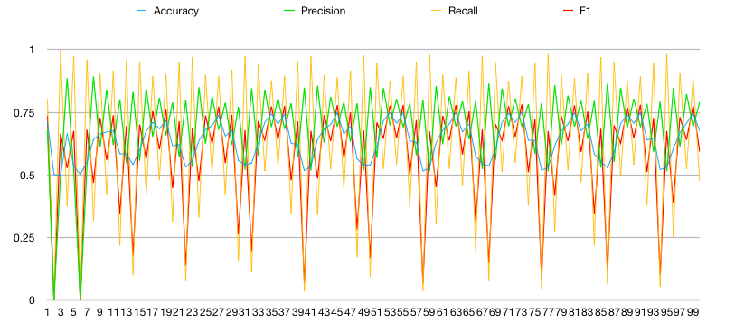 | 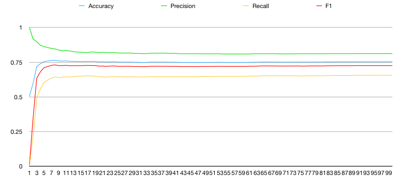 | 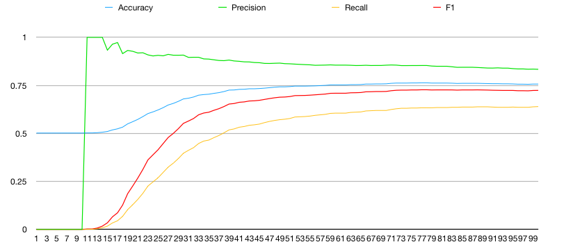 |
| SGD（随机梯度下降） | 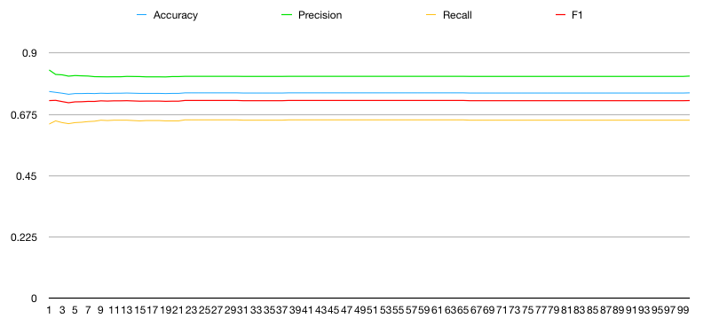   | 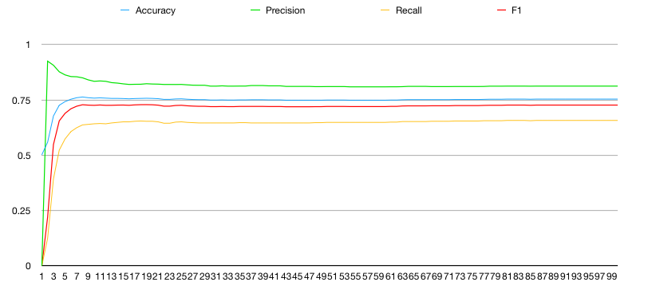   | 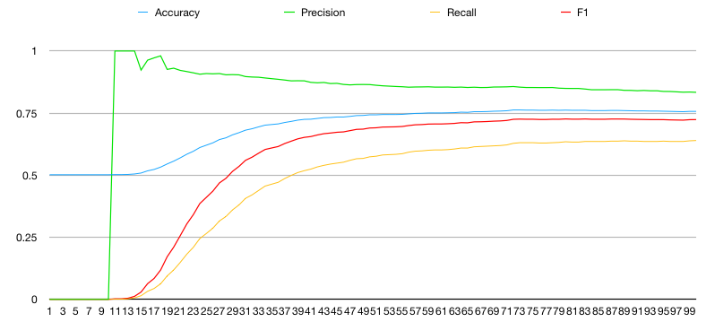   |
| 标准化         | 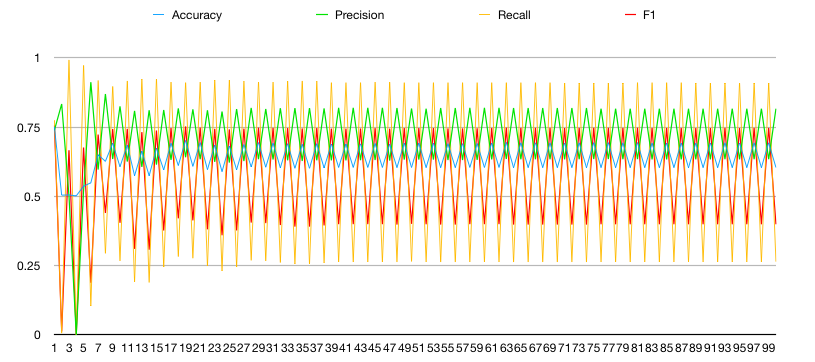   | 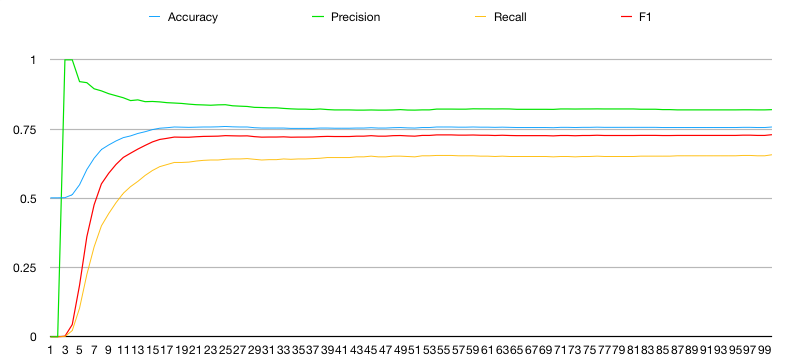   | 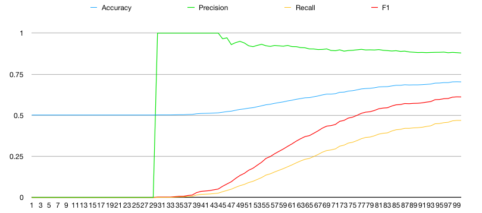   |
| SGD+标准化     | 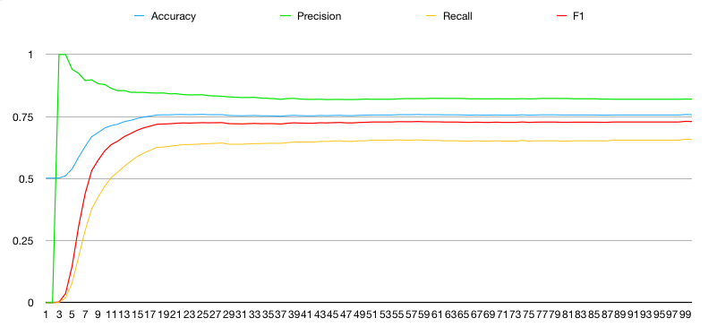    | 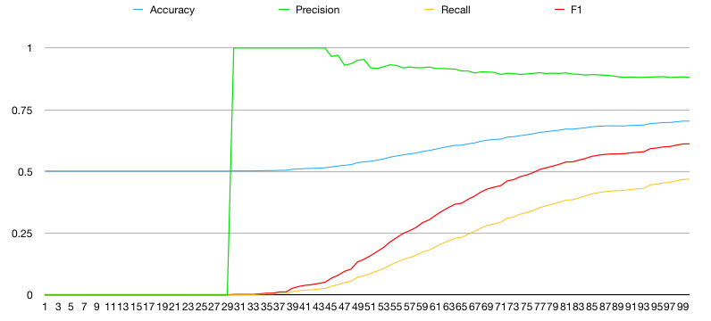    | 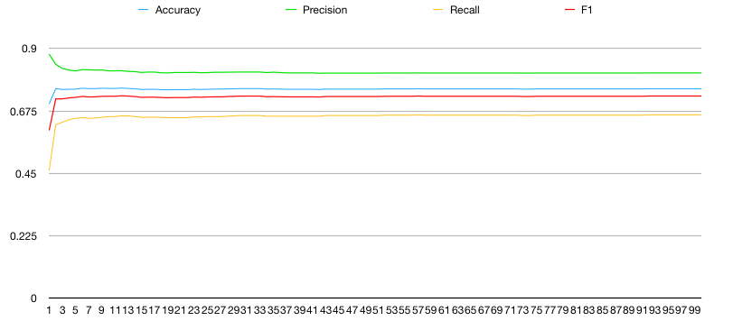    |
| 正则化         | 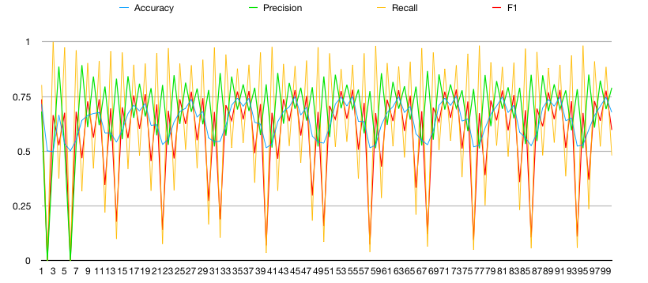   | 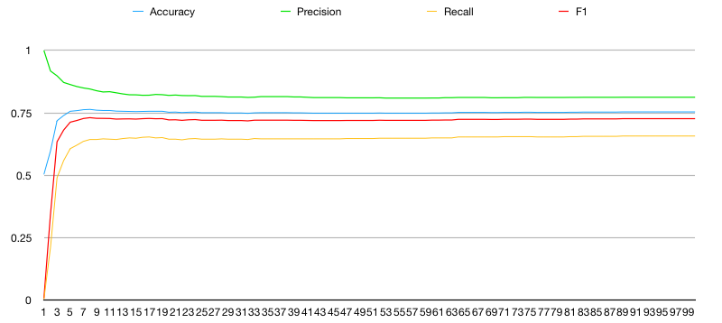   | 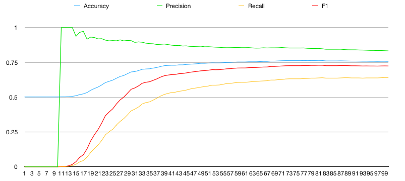   |
| adam动态学习率   | 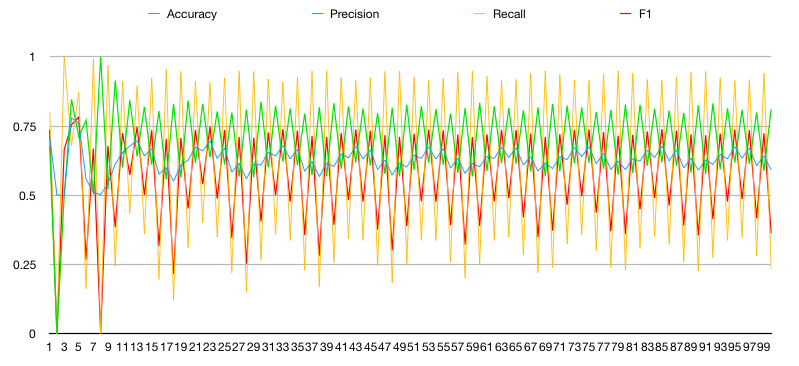   | 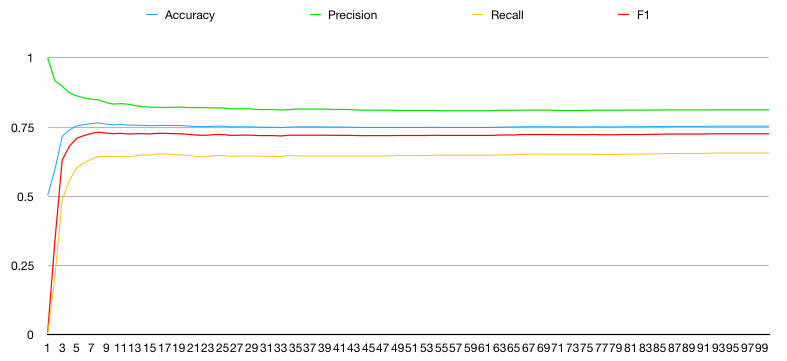   | 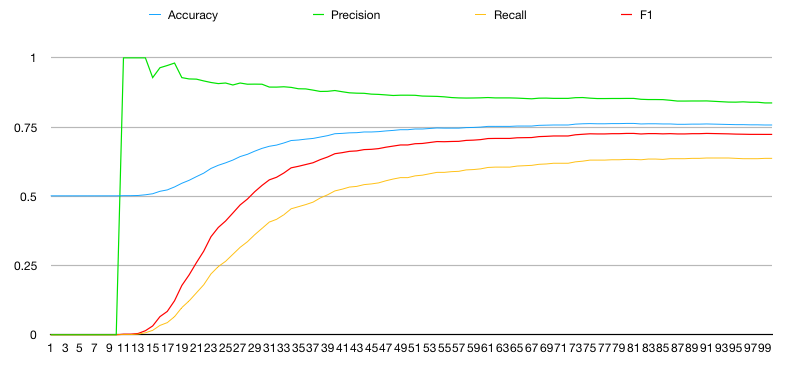   |

可以看到随机梯度下降对于模型的稳定性有显著的优化，同时学习率过大不会收敛，学习率过小不容易收敛。

#### 正则化项优化

这里比较了两种L2正则化系数对于模型损失函数值影响：

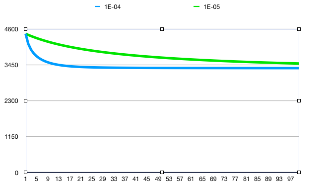

可以看到在收敛速度上有明显的差距。

##四、 思考题

1. 如果把 梯度为 0 作为算法停止的条件，可能存在怎样的弊端？

   1. 可能由于学习率模型不会收敛到梯度为0的位置。
   2. 陷入局部最优。

2. 𝜂 的大小会怎么影响梯度下降的结果？ 给出具体的解释，可视化的解释最好，比如图形展示等

   1. 如实验结果展示，𝜂 偏大会难以收敛，偏小收敛速度慢。

3. 思考这两种优化方法（随机梯度下降，批量梯度下降）的优缺点

   1. 随机梯度下降可以加速收敛速度，但是可能不会一直往“正确的”方向移动，而是通过大量样本弥补单个样本带来的误差
   2. 批量梯度下降可以实现并行实现，但训练速度慢。

   - btw，可以使用mini-batch下降综合两者优点容量大09。


