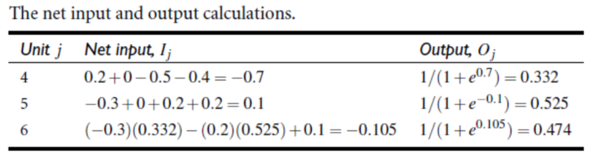
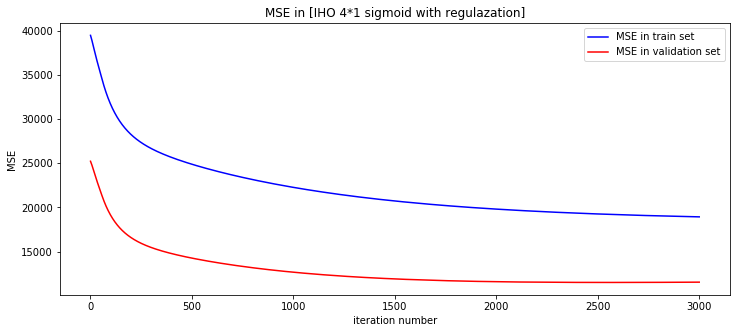

|  | 人工智能实验 |
| ----------------- | ------ |
|                   |        |

##中山大学数据科学与计算机学院移动信息工程专业

##人工智能本科生实验报告

###（2017-2018学年秋季学期）
课程名称：**Artificial Intelligence**

| 教学班级 | **周五5-6** | 专业（方向） | 移动互联网 |
| ---- | --------- | ------ | ----- |
| 学号   | 15352285  | 姓名     | 任磊达   |


[TOC]

##一、 实验题目

> 多层感知机


##二、 实验内容

### 算法原理

多层感知机算法是对于感知机模型和逻辑斯特回归模型的一个综合扩展

1.  在感知机模型当中，我们使用误差项对于w的偏导进行模型更新：

$$
w _i := w_i + \Delta w_i
$$

2. 在逻辑斯特回归模型当中，我们使用对于权重的梯度来更新权重：
   $$
   w_{j,i}=w_{j,i}-\eta \frac{\partial C(w)}{\partial w_j} = w_{j,i} - f(x)(1-f(x))\\when:f(x)=sigmoid(x)
   $$


而这两个模型都受限于神经元的个数，不能分类亦或问题。因此，我们使用多层感知机模型提高模型对于数据的拟合程度：

上图所示的简单多（2）层感知机是由输入层，隐藏层中有多个神经元，而输出层连在隐藏层后面进行对于某类标签的预测。也就是说，感知机模型的预测过程是通过以下过程完成：

####前向传播（预测）

每个神经元（感知机）的输出由加权求和完成：
$$
u = \sum_iw_ix_i+b
\\ O=f(u),where \ f \ is \ active\ function
$$
使用矩阵向量形式构造神经网络可以动态调整，于是使用矩阵形式表述：
$$
\vec u = W\vec x+\vec b
$$

- 对于输出节点：
  $$
  O_j:= f( \vec {W_{L,j}}^T\vec {O_{L-1}}+b_{L,j})
  \\ or:O_j:=\vec {W_{L,j}}^T \vec {O_{L-1}}+b_{L,j}
  \\ 其中： O_j 为输出层第j个输出，W_L为输出层神经网络矩阵，\vec{W_{L,j}}代表接入到O_j神经元的边权值
  \\ O_{L-1}为上一层输出，b_{L,j}是输出层对于第j个节点的偏置,f为激活函数
  $$

- 对于隐藏层节点：
  $$
  O_{l,j}:= f( \vec {W_{l,j}}^T\vec {O_{l-1}}+b_{L,j})
  \\ O_{l,j}:=\vec {W_{l,j}}^T \vec {x}+b_{L,j},\ \  if\ \ l\ ==\ 1 
  \\ 其中： O_j 为隐藏层第j个输出，W_l为隐藏层权值矩阵，\vec{W_{L,j}}代表对于输入到O_j神经元的边权值
  \\ O_{L-1}为上一层输出，b_{L,j}是输出层对于第j个节点的偏置,f为激活函数
  $$


由上文公式，可以递推得到输出层每一个节点输出，对于输出节点，可以按照需求控制是否需要补充一个激活函数。

#### 反向传播（训练）

而对于这样一个神经网络，显然W和b它的是两个模型指标—也就是说确定了W和b的情况下，整个神经网络也就确定了。于是训练这样一个神经网络也就是通过调整W和b的取值，使之更好的拟合数据，从而生成更好的模型：

而在反向传播的过程当中，更新某一层的权值矩阵使用的方法是（随机）梯度下降：
$$
w_{i,j}:=w_{i,j}-\alpha \frac{\partial E}{\partial w_{i,j}}, 其中w_{i,j}是给定W_{l,i}的第j个元素，l层W矩阵第i行第j列
\\b_i:=b_i-\alpha \frac{\partial E}{\partial b_i},其中b_i是给定b_{L,i}元素。
$$
由于前向传播中使用的是对于前一层输出的加权求和，那么对于权值的求导使用的是对于后面层数的链式法则,对于第`l`层函数：
$$
\frac{\partial E}{\partial w_{i,j}^{(l)}} = \frac{\partial E}{\partial O_i^{(l)}}.\frac{\partial O_i^{(l)}}{\partial u_i^{(l)}}.\frac{\partial u_i^{(l)}}{\partial w_{i,j}^{(l)}},\\ \frac{\partial E}{\partial b_{j}^{(l)}} = \frac{\partial E}{\partial O_i^{(l)}}.\frac{\partial O_i^{(l)}}{\partial u_i^{(l)}}.\frac{\partial u_i^{(l)}}{\partial b_{j}^{(l)}}= \frac{\partial E}{\partial O_i^{(l)}}.\frac{\partial O_i^{(l)}}{\partial u_i^{(l)}}
\\对于更新公式，解释如下：
\\ \frac{\partial u_i^{(l)}}{\partial w_{i,j}^{(l)}}=O_{j}^{(l-1)},其中O_{j}^{(l-1)}表示的是上一层输出的第j个节点
\\ \frac{\partial O_i^{(l)}}{\partial u_i^{(l)}}=f^{(l),}_i({u^{l-1}}),表示该节点激活函数的导数
\\ \frac{\partial E}{\partial O_i^{(l)}}=\sum_k W_{k,i}^{(l+1)}\frac{\partial E}{\partial O_{k}^{(l+1)}}\frac{\partial O_{k}^{(l+1)}}{\partial u_{k}^{(l+1)}} ,W_{k,i}^{(l+1)}表示下一层权值矩阵第k行第i个元素
$$
显然，我们可以定义`l`层`i`节点上的误差项来简化公式，提高运算效率：
$$
\delta_{i}^{(l)}=\frac{\partial E}{\partial O_i^{(l)}}.\frac{\partial O_i^{(l)}}{\partial u_i^{(l)}}
\\=f^{(l),}_i({O^{l-1}})\sum_k W_{k,i}^{(l+1)}\frac{\partial E}{\partial O_{k}^{(l+1)}}.\frac{\partial O_{k}^{(l+1)}}{\partial u_{k}^{(l+1)}}
\\=f^{(l),}_i({O^{l-1}})\vec{W_{:,i}^{(l+1)}}.\vec {\delta^{(l+1)}}
$$
这时候对于第`l`层第`i`节点权值矩阵和偏置的更新公式可以写作：
$$
w_{i,j}^{(l)}:=w_{i,j}^{(l)}-\alpha O_{j}^{(l-1)}\delta_{i}^{(l)}
\\
b_i^{(l)}:=b_i^{(l)}-\alpha\delta_{i}^{(l)}
$$
一般而言，可以对于w添加一个正则项来增加鲁棒性：
$$
J = E + \frac{\lambda}{2}\sum w_{i,j}^{(l)2}
\\ \frac{\partial J}{\partial w_{i,j}}=O_{j}^{(l-1)}\delta_{i}^{(l)}+\lambda w_{i,j}^{(l)}
\\ w_{i,j}^{(l)}:=w_{i,j}^{(l)}-\alpha \frac{\partial J}{\partial w_{i,j}^{(l)}}
$$
对于激活函数及其偏导，一般使用以下三种：
$$
f(x)=sigmoid(x)=\frac{1}{1+e^{-x}} =>f'(x)=f(x)(1-f(x))
\\f(x)=tanh(x)=\frac{e^{2x}-1}{e^{2x}+1}=>f'(x)=1-f^2(x)
\\f(x)=relu(x)=max(0,x)=>f'(x)= \left\{
\begin{aligned}
1\ \  & if \ x > 0\\
0\ \ & else\\
\end{aligned}
\right.
$$
神经网络训练中前向传播使用的损失函数为均方误差：
$$
MSE=\frac{1}{N}\sum_{i=1}^{N}(\hat Y_i-Y_i)^2
\\ or\  MSE=\frac{1}{N}\sum_{i=1}^{N}(\hat Y_i-Y_i)^2, (SGD)
$$

### 伪代码

下面代码实现的是**SGD**形式的神经网络模型，实现原始神经网络**需要记录权值更新矩阵**对于forward结果求平均而后使用平均值更新w即可。

```python
initialization(inputLen, layerLen, [layer_i.len]):
    inputL := placeholder(len=inputLen)
    saveL  := inputL # save last layer
    for i in layerLen:
        saveL.nextL   := layer_i
        layer_i.lastL := saveL
        layer_i.w     := random_matrix(size=layer_i.len*saveL.len) # or zero
        layer_i.b     := random_vector(len=layer_i.len)            # or zero
        saveL         := layer_i
    outputL:= saveL  # output layer is calculated in the len of MLP
   
forward(x, ActiveF):
    place x in inputL.o
    saveL := inputL
    for i in layerLen: # or "do ... while saveL != outputL"
        layer_i.u     := layer_i.w * saveL.o + layer_i.b
        layer_i.o     := ActiveF(layer_i.u) # or set if in output
        saveL := layer_i
    return outputL.o  # or output.u, updated as the last saveL
        
backward_sgd(y, PartialActiveF(x,w), alpha)
    # calcu delta in each node
    outputL.e := (outputL.o - y) .* PartialActiveF(outputL.lastL.o, outputL.w)
    saveL := outputL.lastL
    while saveL != inputL:
        for i in saveL.len:
	        saveL.e[i] := PartialActiveF(saveL.lastL.o, saveL.w)  \
        			.* (saveL.nextL.w[:i] .* saveL.nextL.e)
        saveL = saveL.lastL
    # update weight
    outputL.w := outputL.w - alpha * output.e * output.lastL.o' # sgn not need m
    outputL.b := outputL.b - alpha * output.e
    saveL := outputL.lastL
    while saveL != inputL:
        saveL.w := saveL.w - alpha * saveL.e * saveL.lastL.o'
        saveL.b := saveL.b - alpha * saveL.e
        saveL = saveL.lastL
```

对于普通梯度下降，下降部分伪代码应该如下：

```python
backward_init()
    outputL.updw := 0
    outputL.updb := 0
    saveL := outputL.lastL
    while saveL != inputL:
        saveL.updw := 0
        saveL.updb := 0
        saveL = saveL.lastL

# for every sample in training set
backward_calcu(y, PartialActiveF(x,w))
    # calcu delta in each node
    outputL.e := (outputL.o - y)/M .* PartialActiveF(outputL.lastL.o, outputL.w)
    saveL := outputL.lastL
    while saveL != inputL:
        for i in saveL.len:
	        saveL.e[i] := PartialActiveF(saveL.lastL.o, saveL.w)  \
        			.* (saveL.nextL.w[:i] .* saveL.nextL.e)
        saveL = saveL.lastL
    # update weight
    outputL.updw := outputL.updw - output.e * output.lastL.o' 
    outputL.updb := outputL.updb - output.e
    saveL := outputL.lastL
    while saveL != inputL:
        saveL.updw := saveL.updw - saveL.e * saveL.lastL.o'
        saveL.updb := saveL.updb - saveL.e
        saveL = saveL.lastL

backward_upd(alpha)
    # update weight
    outputL.w := outputL.w - alpha * outputL.updw
    outputL.b := outputL.b - alpha * outputL.updb
    saveL := outputL.lastL
    while saveL != inputL:
        saveL.w := saveL.w - alpha * saveL.updw
        saveL.b := saveL.updb - alpha * saveL.b
        saveL = saveL.lastL
```

### 关键代码

#### 多层感知机

构建神经网络=》训练

```c++

// decrease learning rate depend on the performance on validation
void MultilayerPerception::MLPmodel(int hdLNum , int hidden_len , int max_iter , double alpha , PARTIAL_TYPE pt
                                    ){
    // construct
    InputLayer = new placeHolder(data.xLen);
    placeHolder * lastLayer = InputLayer;
    for(int l = 0; l < hdLNum; ++l)
    {
        MLPLayer *Hidden = new MLPLayer(hidden_len, lastLayer->value.size());
        lastLayer->nextLayer = Hidden;
        Hidden->lastLayer = lastLayer;
        lastLayer = Hidden;
    }
    double lastrev = 1e7, rev;
    OutputLayer = new MLPLayer(1, hidden_len);
    lastLayer->nextLayer = OutputLayer;
    OutputLayer->lastLayer = lastLayer;
    
    for(int iter = 1; iter <= max_iter; ++iter)
    {
        // train
        for(int dt = 0; dt < data.trainx.size(); ++dt)
        {
            InputLayer->value = data.trainx[dt];
            forward(pt);
            
            backward(data.trainy[dt], alpha, 0, pt);
        }
        
        // validate
        if(iter % 10 == 0)
        {
            rev = validate(iter, pt);
            if(rev > lastrev)
                alpha *= 0.8;
            lastrev = rev;
        }
    }
    MLPLayer *w = (MLPLayer*)InputLayer->nextLayer, *h;
    delete InputLayer;
    while(w)
    {
        h =  (MLPLayer*)w->nextLayer;
        delete w;
        w = h;
    }
}
```

#### 前向传播

将已经放入输入层的数据进行迭代计算

```c++
// implementation of mlp class
double MultilayerPerception::forward(PARTIAL_TYPE pt, PARTIAL_TYPE opt)
{
    placeHolder *iteration = InputLayer;
    MLPLayer *next;
    
    while (iteration->nextLayer != NULL) {
        next = (MLPLayer*)iteration->nextLayer;
        for(int v = 0; v < next->value.size(); ++v)
        {
            if(isnan(next->bias[v])) next->bias[v] = 0;
            next->value[v] = next->bias[v];
            for(int r = 0; r < iteration->value.size(); ++r)
            {
                if(isnan(next->weight[v][r]))next->weight[v][r]=0;
                next->value[v] += next->weight[v][r] * iteration->value[r];
            }
            // last layer do not need active function
            if(next->nextLayer != NULL)
                next->value[v] = fx(next->value[v], pt);
            else // output layer
                next->value[v] = fx(next->value[v], opt);
        }
        iteration = next;
    }
    return iteration->value[0];
}
```

#### 反向传播（SGD)

批量梯度下降见代码`backward0`,`backward1`,`backward2`

```c++
void MultilayerPerception::backward(double label, double alpha,double lambda, PARTIAL_TYPE pt, PARTIAL_TYPE bkpt)
{
    // calcu error
    // output layer(with active)
    MLPLayer *nextL = OutputLayer;
    nextL->err[0] = (label-nextL->value[0]) * partial(nextL->value[0], bkpt);
    // hidden layer
    placeHolder *nowL = nextL->lastLayer;
    // calcu -err here, so the next is add err('-err')
    while(nowL->lastLayer != NULL) //input layer
    {
        MLPLayer *NL = (MLPLayer*) nowL;
        for(int w = 0; w < NL->value.size(); ++w)
        {
            NL->err[w] = 0;
            for(int i = 0; i < NL->nextLayer->value.size(); ++i)
            {
                NL->err[w] += nextL->err[i] * nextL->weight[i][w];
            }
            NL->err[w] *= partial(NL->value[w], pt);
        }
        nowL = nowL->lastLayer;
        nextL = (MLPLayer*) nextL->lastLayer;
    }
    // update w and b
    nowL = OutputLayer;
    while(nowL->lastLayer != NULL)//input layer
    {
        MLPLayer *NL = (MLPLayer*) nowL;
        for(int w = 0; w < NL->err.size(); ++w)
        {
            NL->bias[w] += alpha * NL->err[w];
            for(int nw = 0; nw < NL->lastLayer->value.size(); ++nw)
            {
                NL->weight[w][nw] *= (1 - lambda);// regulazation element
                NL->weight[w][nw] += alpha * NL->err[w] * NL->lastLayer->value[nw];
            }
        }
        nowL = nowL->lastLayer;
    }
}

```

### 创新点&优化

1. 二进制编码离散数据，标准化连续属性。（见数据预处理代码）
2. 尝试不同激活函数，参照tensorflow对于层数进行封装和继承。
3. 增加神经网络层数
4. 增加神经网络节点数
5. 依据在验证集上表现，调整动态学习率
6. 添加正则项
7. 使用随机梯度下降


##三、 实验结果及分析

###实验结果展示示例
模型：


数据初始化：


```c++
void demo_test_bp(){
  InputLayer = new placeHolder(3);
  vector<double> &x = InputLayer->value;
  x[0] = 1; x[1] = 0; x[2] = 1;
  double y = 1;

  MLPLayer *H = new MLPLayer(2,3);
  InputLayer->nextLayer = H;
  H->lastLayer = InputLayer;
  H->weight[0][0] = 0.2; H->weight[1][0] = -0.3;
  H->weight[0][1] = 0.4; H->weight[1][1] = 0.1;
  H->weight[0][2] = -0.5;H->weight[1][2] = 0.2;
  H->bias[0] = -0.4; H->bias[1] = 0.2;

  OutputLayer = new MLPLayer(1,2);
  H->nextLayer = OutputLayer;
  OutputLayer->lastLayer = H;
  OutputLayer->weight[0][0] = -0.3;
  OutputLayer->weight[0][1] = -0.2;
  OutputLayer->bias[0] = 0.1;

  forward() ;
  backward(y, 0.9);
}
```

前向传播




反向传播：

计算误差：


更新权值：


(bias，权重更新，顺序6-4-5)


###评测指标展示即分析

> 基础指标&优化指标

使用12月份数据作为验证集，其他月份数据作为训练集，默认进行3000次迭代：

图示：

可以从图示中看到，没有控制学习率的算法有主要两个问题：

1. 对于训练集过拟合，导致在验证集上误差后期变大
2. 不能稳定在极小值点，而是不停地波动

具体解决方案分别为:

1. 使用正则项惩罚对于训练集的过拟合。
2. 使用动态学习率。

| 优化策略\激活函数    | sigmoid         | tanh            | relu            |
| ------------ | --------------- | --------------- | --------------- |
| 隐藏层神经元个数     |  |  |  |
| 原始梯度下降       |  |  |  |
| 原始+动态学习率     |  |  |  |
| SGD          |  |  |  |
| SGD+正则       |  |  |  |
| SGD+正则+动态学习率 |  |  |  |

最优解
| 优化策略\激活函数    | sigmoid | tanh    | relu        |
| ------------ | ------- | ------- | ----------- |
| 隐藏层神经元个数     | 8116.88 | 10315.4 | **6118.79** |
| 原始梯度下降       | 11496.2 | 11503.3 | 11457.1     |
| 原始+动态学习率     | 11496.7 | 10383.3 | 11457.9     |
| SGD          | 8412.86 | 6915.71 | 11777.7     |
| SGD+正则       | 8449.1  | 7194.87 | 11241.0     |
| SGD+正则+动态学习率 | 11503.5 | 11503.6 | 10823.4     |

多层神经网络，使用tanh激活函数，每层5个节点，测试在验证集上表现与层数关系


其中表现较好的前10层具体数值为：

| 层数   | 训练集误差       | 验证集误差       |
| ---- | ----------- | ----------- |
| 0    | 8210.29     | 11663.9     |
| 1    | 7001.34     | 9736.15     |
| 2    | 7738.39     | 8654.14     |
| 3    | 6996.51     | 8985.76     |
| 4    | 6395.5      | 8797.26     |
| 5    | **3327.98** | 9377.46     |
| 6    | 18625.9     | 11503.7     |
| 7    | 5295.57     | 8154.53     |
| 8    | 5970.66     | 7969.3      |
| 9    | 18438.1     | 11504.2     |
| 10   | 5102.31     | **5099.12** |

在12月份上的模型表现（tanh，5*1，1e-7学习率，1e-7正则化系数）


可见在一定程度上预测了数据趋势，但是未能拟合高度偏置。

##四、 思考题

1. 尝试说明下其他激活函数的优缺点

   | 函数名称    | 优点               | 缺点              |
   | ------- | ---------------- | --------------- |
   | sigmoid | 有实际概率含义（softmax） | 计算量大，涉及除法，易梯度消失 |
   | Tanh    | 不易梯度消失           | 计算量大            |
   | Relu    | 计算量小，克服梯度消失      | 神经元可能不再被激活      |

2. 有什么方法可以实现传递过程中不激活所有节点？

   - 在每一层设置一个概率向量，满足概率时候激活。
   - （反向传播）使用dropout去过拟合，不更新部分节点。

3. 梯度消失和梯度爆炸是什么？可以这么解决？

   在反向传播过程中，由于激活函数不同以及链式法则的累乘效应，sigmoid函数对于梯度一步步下降，容易造成梯度消失的现象，而tanh函数则相反，会逐层累加，易造成梯度爆炸。

   简而言之，梯度消失是反向传播过程中到了接近输入层的几层不再带有误差信息（上一层误差项逼近0），而梯度爆炸则是上一层误差接近无穷。

   一方面可以减少网络层数，另一方面可以交替使用激活函数，使用循环神经网络的结构来优化。
