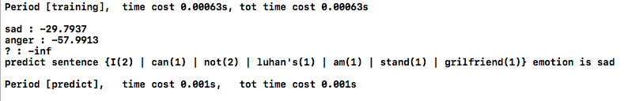

|  | 人工智能实验 |
| --------------- | ------ |
|                 |        |

##中山大学数据科学与计算机学院移动信息工程专业

##人工智能本科生实验报告

###（2017-2018学年秋季学期）
课程名称：**Artificial Intelligence**

| 教学班级 | **周五5-6** | 专业（方向） | 移动互联网 |
| ---- | --------- | ------ | ----- |
| 学号   | 15352285  | 姓名     | 任磊达   |


[TOC]

##一、 实验题目

> K近邻与朴素贝叶斯
>
> -- 分类和回归

##二、 实验内容

### 算法原理

#### KNN分类

选取k个特征向量最邻近的数据，取众数得到分类结果。

#### KNN回归

选取k个特征向量最临近的数据，数据/距离而后归一化得到回归结果。

#### NB分类


1. 依据`wordbag` 内部词汇使用朴素贝叶斯方法得到六种情感的后验概率。

$$
P(Emotion|Sentence) = \frac{P(Emotion,Sentence)}{P(Sentence)} = \frac{P(Emotion)P(Sentence|Emotion)}{P(Sentence)}
\\
P(Emotion|Sentence) = \prod_i^{n} {P(Emotion|Word_i)}
$$

2. 由于部分词汇对于某种情感不存在训练样本,必须使用拉普拉斯平滑概率。

$$
P(Emotion|Word_i) = \frac{P(Emotion) * (P(Word_i|Emotion) + \alpha)}{P(Word_i) + \beta}
\\
P(Word_i|Emotion) ~= \frac{N(Word_i, Emotion)}{\sum_{j \in Emotion}N(Word_j)}
\\
P(Word_i) = \frac{N(Word_i)} { \sum_j N(Word_j)}
$$

3. 由于计算数值比较小，C++中浮点数运算容易下溢，故适用`log` 转化概率：
   $$
   p(Emotion|Sentence) :=  \sum_i logP(Emotion|Word_i)
   \\ :=\sum_i (log(P(Emotion)) - log(\sum_j(Word_j)) +log(\sum_{j\in Emotion}N(Word_j) )\\ + log(\frac{N(Word_i, Emotion)+\alpha}{N(Word_i) + \beta}))
   \\
   := Count(Words) *( log(P(Emotion)-log(TotWords)+log(TotEmotion))\\ + \sum_i  log(\frac{N(Word_i, Emotion)+\alpha}{N(Word_i) + \beta}))
   \\
   := Count*F(i) + \sum_i G(i, Emotion)
   $$

4. 优化设计后，公式为：
   $$
   p(Emotion|Sentence) :=\\ log(P(Emotion)) - Count(Words) *(log(Count(Word_{emo}) + \alpha * Trainsize )))\\+\sum_i (Count_{word_i,Emotion} + \alpha)
   $$


#### NB回归

1. 原理与NB分类类似，但是和KNN回归一样对于数据**归一化**要求较高。

2. 通过原始数据得到每个词与情感的分布之后，对于测试数据累乘。

3. 基于分类公式设计的优化后Laplace回归公式为：
   $$
   p(Emotion|Sentence) :=\\ log(P(Emotion)) - Count(Words) *(log(\alpha * Count(Word_{emo}) + Trainsize )))\\+\sum_i (Count_{word_i,Emotion + \alpha})
   $$


在多项式模型中：

> 在多项式模型中， 设某文档d=(t1,t2,…,tk)，tk是该文档中出现过的单词，允许重复，则
>
> 先验概率P(c)= 类c下单词总数/整个训练样本的单词总数
>
> 类条件概率P(tk|c)=(类c下单词tk在各个文档中出现过的次数之和+1)/(类c下单词总数+|V|)
>
> V是训练样本的单词表（即抽取单词，单词出现多次，只算一个），|V|则表示训练样本包含多少种单词。 P(tk|c)可以看作是单词tk在证明d属于类c上提供了多大的证据，而P(c)则可以认为是类别c在整体上占多大比例(有多大可能性)。

在伯努利模型中：

> P(c)= 类c下文件总数/整个训练样本的文件总数
>
> P(tk|c)=(类c下包含单词tk的文件数+1)/(类c下单词总数+2)

### 流程图

#### KNN分类
```flow
st=>start: 开始写代码啦！激动地搓手手
read=>operation: 读入训练文本数据，转化为OneHot矩阵，存储
cal0=>operation: 读入测试文本，转化为OneHot矩阵
cal1=>operation: 通过某种距离测量方式，找到k个离测试数据最近的文本
cal2=>operation: 使用这k个训练文本的标签的众数预测测试文本的标签
e=>end: 愉快地调参
st->read->cal0->cal1->cal2->e
```

#### KNN回归
```flow
st=>start: 开始写代码啦！激动地搓手手
read=>operation: 读入训练文本数据，转化为OneHot矩阵，存储
cal0=>operation: 读入测试文本，转化为OneHot矩阵
cal1=>operation: 通过某种距离测量方式，找到k个离测试数据最近的文本
cal2=>operation: 这k个文本的每种标签的预测值，加入距离的权重，得到测试文本的权重
cal3=>operation: 对于测试文本权重归一化，而后除以和，使得总和为1
e=>end: 愉快地调参
st->read->cal0->cal1->cal2->cal3->e
```

#### NB分类
```flow
st=>start: 开始写代码啦！激动地搓手手
read=>operation: 读入训练文本数据，统计每种词对应情感次数，训练集维度，每种情感训练数据个数
cal0=>operation: 预处理数据，如使用log等，但是不用归一化
cal1=>operation: 读入测试文本，依赖拉普拉斯平滑的朴素贝叶斯，对于每个词汇计算概率，取log计算
cal2=>operation: 使用计算得到概率的最大值，作为NB分类的结果
e=>end: 愉快地调参
st->read->cal0->cal1->cal2->e
```

#### NB回归
```flow
st=>start: 开始写代码啦！激动地搓手手
read=>operation: 读入训练文本数据，统计每种词对应每种情感概率的和
cal0=>operation: 词汇情感矩阵，以情感划分，对于每一列归一化。
cal1=>operation: 读入测试文本，依赖拉普拉斯平滑的朴素贝叶斯，对于每个词汇计算概率，取log计算
cal3=>operation: 对于测试文本权重归一化，而后除以和，使得总和为1
e=>end: 愉快地调参
st->read->cal0->cal1->cal3->e
```

### **关键**代码截图

#### KNN分类


```c++
const double eps = 1e-10;
int KNN(const int &k, const rowData & rD)
{
    priority_queue<pair<double, int> > maxK; // 使用优先队列，得到前k个值
    while(maxK.size()) maxK.pop();

    // counting distance， 距离计算，使用OneHot×IDF方法
    for(int st = 0; st < Library.size(); ++st)
    {
        
        // 放入队列中，由于最初的队列是大顶堆，取负数
        maxK.push(make_pair(
            (eps+cosDistance(rD.IDs, rD.totWords, Library[st].IDs, Library[st].totWords)) // 1.0/l1Distance()
            , Library[st].Emotion));
    }
    // voting， 相当于取众数
    vector<double> voting_pool(emotionID + 1, 0);
    for(int i = 0; i < k; ++i)
    {
        if(maxK.size())
        {
            voting_pool[maxK.top().second]+=maxK.top().first;// 这里取众数为++，这里有一个voting的优化，使得每个voting的权值与距离相关，可以提高准确率。 
            maxK.pop();
        }
    }

    int ans = 1;    // 众数标签
    double maxV = -1, minV = voting_pool[1];  // 众数值
    for(int i = 1; i <= emotionID; ++i)
    {
        if(voting_pool[i] > maxV)
        {
            maxV = voting_pool[i];
            ans = i;
        }
    }
    return ans;
}
```

#### KNN回归

#####距离计算

```c++
// 使用了统计词频的矩阵，比OneHot多了一个出现次数
inline double cosDistance(map<int, int> v1, int size1, map<int, int> v2, int size2)
{
    mit i1 = v1.begin();
    mit i2 = v2.begin();
    double same = 0;
    while(i1 != v1.end() && i2 != v2.end())
    {
        if(i1->first == i2->first)
        {
            same +=  i1->second * i2->second; // 相同个数是乘积
            i1++; i2++;
        }
        else if(i1->first < i2->first)
            i1++;
        else
            i2++;
    }
    return same / (size1 * size2); 
}
// l1, l2距离计算与KNN分类类似，不再赘述
```

##### TFIDF优化距离

1. 对于特征向量进行归一化（除以方差）
2. 最后不除以两个模长的乘积，但是为了保持借口，依旧传入大小

```c++
inline double cosDistance_tfidf(map<int, int> v1, int size1, map<int, int> v2, int size2)
{
    mit i1 = v1.begin();
    mit i2 = v2.begin();
    double same = 0, tfidf1, tfidf2;
    double sum1 = 0, sum2 = 0;
  	// 这里对于行内词向量做一次归一化
    for(; i1 != v1.end(); ++i1)
    {
        tfidf1 += wordCount[i1->first] ? i1->second * 1.0 / wordCount[i1->first] : i1->second;
        sum1 += tfidf1 * tfidf1;
    }   
    for(; i2 != v2.end(); ++i2)
    {
        tfidf2 += i2->second * 1.0 / wordCount[i2->first];
        sum2 += tfidf2 * tfidf2;
    } 
    sum1 = sqrt(sum1);
    sum2 = sqrt(sum2);

    i1 = v1.begin();
    i2 = v2.begin();
    while(i1 != v1.end() && i2 != v2.end())
    {
        tfidf1 = wordCount[i1->first] ? i1->second * 1.0 / wordCount[i1->first] : i1->second;
        tfidf2 = i2->second * 1.0 / wordCount[i2->first];
        tfidf1 /= sum1;
        tfidf2 /= sum2;
        if(i1->first == i2->first)
        {
            same +=  tfidf1 * tfidf2; // 相同个数是乘积
            i1++; i2++;
        }
        else if(i1->first < i2->first)
            i1++;
        else
            i2++;
    }
    return same; // 这里不除以两个长度的乘积表现更优
}
```


##### 回归计算

```c++
void KNN(int k, const rowData & rD, int type)
{
    priority_queue<pair<double, int> > maxK;
    while(maxK.size()) maxK.pop();

    double emotion[6];
    for(int i = 0; i < TOTEMOTION; ++i) emotion[i] = 0;

    for(int st = 0; st < Library.size(); ++st)
    {
        switch(type)
        {
            case 1 : maxK.push(make_pair(eps + cosDistance(rD.IDs, rD.totWords, Library[st].IDs, Library[st].totWords),st));
                break;
            case 2 : maxK.push(make_pair(eps + cosDistance_tfidf(rD.IDs, rD.totWords, Library[st].IDs, Library[st].totWords),st));
                break;
            case 3 : maxK.push(make_pair(eps + 1.0/l1Distance(rD.IDs, rD.totWords, Library[st].IDs, Library[st].totWords),st));
                break;
            case 4 : maxK.push(make_pair(eps + l1Distance_tfidf(rD.IDs, rD.totWords, Library[st].IDs, Library[st].totWords),st));
                break;
            case 5 : maxK.push(make_pair(eps + 1.0/l2Distance(rD.IDs, rD.totWords, Library[st].IDs, Library[st].totWords),st));
                break;
            case 6 : maxK.push(make_pair(eps + l2Distance_tfidf(rD.IDs, rD.totWords, Library[st].IDs, Library[st].totWords),st));
                break;
            case 7 : maxK.push(make_pair(eps + one_hotDistance(rD.IDs, rD.totWords, Library[st].IDs, Library[st].totWords),st));
                break; 
            default: cerr << "FAULT TYPE" << endl;
        }
    }
    for(int i = 0; i < k; ++i)
    {
        if(maxK.size())
        {
            double samebility = maxK.top().first;
            int idx = maxK.top().second;
            maxK.pop();
            for(int i = 0; i < 6; i++)
            {
                emotion[i] += Library[idx].Emotion[i] * samebility;// * distance when use cos
            }
        }
    }

    // standard score
    // 归一化， 这里最后一步没有减去均值u，防止出现负数
    double u, d, sum = 0;
    for(int i = 0; i < TOTEMOTION; ++i)
    {
        sum += emotion[i];
    }
    u = sum / TOTEMOTION;
    sum = 0;
    for(int i = 0; i < TOTEMOTION; ++i)
    {
        sum += (emotion[i] - u) * (emotion[i] - u);
    }
    d = sqrt(sum / TOTEMOTION);
    for(int i = 0; i < TOTEMOTION; ++i)
        emotion[i] = (emotion[i] ) / d;
    // 尺度放缩
    double maxV = emotion[0], minV = emotion[0]; // delete negative
    for(int i = 0; i < TOTEMOTION; ++i)
    {
        minV = min(minV, emotion[i]);
        maxV = max(maxV, emotion[i]);     
    }
    for(int i = 0; i < TOTEMOTION; ++i)
    {    
        emotion[i] = (emotion[i] - minV) / (maxV - minV);
    }
    // change sum to 1:
    sum = 0;
    for(int i = 0; i < TOTEMOTION; ++i)
    {
        sum += emotion[i];
    }
    for(int i = 0; i < TOTEMOTION; ++i)
    {
        emotion[i] /= sum;
    }
    // 存储，用于计算相关系数
    for(int i = 0; i < TOTEMOTION; i++)
        rV.Emotion[i] = emotion[i];

}
```

##### 相关度统计

为了得到较优的k值，实现EXCEL中相关度的公式

```c++
// standard 存储标准答案
// predict 存储预测答案
double cor[TOTEMOTION], corsum = 0; // 六种感情的相关度，以及平均值
double ass[TOTEMOTION], asp[TOTEMOTION];
vector<double> s_s[TOTEMOTION], p_p[TOTEMOTION];
for(int i = 0; i < TOTEMOTION; ++i)
{
  cor[i] = ass[i] = asp[i] = 0;
  for(int j = 0; j < standard.size(); ++j)
  {
    ass[i] += standard[j].Emotion[i];
    if(!isnan(predict[j].Emotion[i])) // 可能中间运算中出现nan
      asp[i] += predict[j].Emotion[i];
  }
  ass[i] /= standard.size();
  asp[i] /= standard.size();// mean

  for(int j = 0; j < standard.size(); ++j)
  {
    s_s[i].push_back(standard[j].Emotion[i] - ass[i]);
    if(!isnan(predict[j].Emotion[i]))
      p_p[i].push_back(predict[j].Emotion[i] - asp[i]);
    else p_p[i].push_back(standard[j].Emotion[i] - ass[i]);
  }
  double sum1 = 0, sum2 = 0, sum3 = 0;

  for(int j = 0; j < standard.size(); ++j)
  {
    sum1 += s_s[i][j] * p_p[i][j];
    sum2 += s_s[i][j] * s_s[i][j];
    sum3 += p_p[i][j] * p_p[i][j];    
  }
  cor[i] = sum1 / sqrt(sum2 * sum3);
  corsum += cor[i];
}
#ifndef MT
printf("%d,%lf", k, corsum / TOTEMOTION);
for(int i = 0; i < TOTEMOTION ; ++i) printf(",%lf", cor[i]);
puts("");
#endif
```

##### 上采样

统计之后把极端样本（该类中样本大于这个值的<10%)的样本上采样，显著提高准确率。

```c++
 while(readDataTorD())
    {
        if(rD.Emotion[0] > 0.4
            || rD.Emotion[1] > 0.25
            || rD.Emotion[2] > 0.6
            || rD.Emotion[4] > 0.9)
            Library.push_back(rD);
        Library.push_back(rD);
    }
```

#### NB分类

##### naive贝叶斯公式

```c++
double step = 1e-100;
for(double alpha = step; alpha < 10 ; alpha *= 10)

 TestPossibility = words.totWords * (log(emotionP[i]) - log(TrainSize) + log(emotionP[i] * Library.size()));
for(mit iz = words.IDs.begin(); iz != words.IDs.end(); ++iz)
{
  TestPossibility += iz->second 
    * log((wordEmotionCount[iz->first][i] + alpha* TrainSize ) / (wordCount[i] + alpha ));
}
```


#####优化后分类公式

依据原理部分，简化运算方法，依据平滑项达可变性，简化公式，提升准确率。

由于这里emotion没有乘以词向量长度

```c++
for(double alpha = 0.0001; alpha < 10.00005; alpha += 0.0001)
// calcu TestPossibility for emotion[i]
TestPossibility = log(emotionP[i]) - words.totWords * log(nck[i].size() + alpha * TrainSize);
for(mit iz = words.IDs.begin(); iz != words.IDs.end(); ++iz)
{
  TestPossibility += iz->second 
    * log(wordEmotionCount[iz->first][i] + alpha);
}
```

#### NB回归

##### 归一化

```c++
// 归一化一下 wordEmotionCount
    for(int emo = 0; emo < MAX_EMOTION; ++emo)
    {
        sum = 0;
        for(int i = 0; i < MAX_WORD; ++i)
            sum += wordEmotionCount[i][emo]*wordEmotionCount[i][emo];
        sum = sqrt(sum);
        for(int i  =0; i < MAX_WORD; ++i)
            wordEmotionCount[i][emo] /= sum;
    }
```

#####回归计算

```C++
	for(int emo = 0; emo < MAX_EMOTION; ++emo)
    {
        emotion[emo] = log(emotionP[emo])
        - words.totWords * log(alpha * nck[emo].size() + TrainSize);
        for(mit iz = words.IDs.begin(); iz != words.IDs.end(); ++iz)
        {
            emotion[emo] += iz->second 
                        * log(wordEmotionCount[iz->first][emo] + alpha);
        }
    }
```


### 创新点&优化

#### KNN分类

1. 使用短词模型，删除my，the一类的助词
2. 测试多种不同的距离，和距离定义位置。

#### KNN回归

1. 对于距离纵向进一步归一化。
2. 上采样感情数量较低较低的样本。

#### NB分类

1. 公式化简贝叶斯优化公式。
2. 多阶段划分测试alpha。

#### NB回归

1. 对于每种情感归一化。
2. 调整传统贝叶斯公式，使用优化后贝叶斯公式。
3. 废弃短词，可以小幅度提高准确率。

##三、 实验结果及分析

###实验结果展示示例
> 分类用小数据测试，回归使用验证集相似度展示
>
> 分类小数据集：
>
> 训练集：
>
> | **Words**                          | **label** |
> | ---------------------------------- | --------- |
> | **I can not find test**            | sad       |
> | **hello this is my girlfriend**    | sad       |
> | **She is luhan's girlfriend**      | sad       |
> | **I am not his girfriend**         | sad       |
> | **I can not stand his girlfriend** | anger     |
>
> 测试集：
>
> | **Words**                                | **label** |
> | ---------------------------------------- | --------- |
> | **I can not stand I am not luhan's grilfriend** | ?         |
>

#### KNN分类

> 使用欧式距离


#### KNN回归


#### NB分类



#### NB回归


###评测指标展示即分析
> 基础指标&优化指标

#### KNN分类

对于k取值[1,120)，使用六种距离测量方式进行模型评估，其中

- MULTI： 词频 * IDF
- TFIDF ：TF * IDF

可以看到在L1范数下使用`MULTI` 较优，在L2范数下`MULTI` 不如`TFIDF`

在K值合适的情况下，`MULTI_L1` 方法和`TFIDF_L1`在验证集上均达到了`0.44373` 准确率。


#### KNN回归

#####不同距离度量比较(without upsamping)

测量不同k值对于回归相关度的影响，可以看到优化后的余弦相似度-tfidf有卓越的性能。


#####上采样效果（*选取最优距离测量方式*）

对于每种情感，以0.1为间隔计数，如`Emotion[0]: 208 105 42 16 8 2 1 0 0 0`指大于0.1的有105个,依据计数结果设计两种上采样方式，上采样结果如下：

| 原始数据                                     | 上采样方式A                                   | 上采样方式B                                   |
| ---------------------------------------- | ---------------------------------------- | ---------------------------------------- |
| Emotion[0]: 208 105 42 16 8 2 1 0 0 0    | Emotion[0]: 271 150 65 32 16 4 2 0 0 0   | Emotion[0]: 242 131 58 29 16 4 2 0 0 0   |
| Emotion[1]: 129 54 17 8 2 0 0 0 0 0      | Emotion[1]: 188 107 34 16 4 0 0 0 0 0    | Emotion[1]: 158 80 34 16 4 0 0 0 0 0     |
| Emotion[2]: 329 211 126 66 37 12 4 2 0 0 | Emotion[2]: 405 266 168 104 73 24 8 4 0 0 | Emotion[2]: 366 235 146 85 55 24 8 4 0 0 |
| Emotion[3]: 331 280 243 212 178 145 102 57 18 10 | Emotion[3]: 348 285 244 212 178 145 102 57 18 10 | Emotion[3]: 336 280 243 212 178 145 102 57 18 10 |
| Emotion[4]: 365 244 151 108 64 31 15 8 4 1 | Emotion[4]: 457 299 172 117 70 35 19 12 8 2 | Emotion[4]: 410 265 160 111 66 32 16 9 5 2 |
| Emotion[5]: 457 276 181 109 67 35 19 13 6 5 | Emotion[5]: 510 300 194 117 73 40 24 18 11 10 | Emotion[5]: 489 290 190 115 73 40 24 18 11 10 |

上采样后回归率提高情况如下,可见在上采样之后回归相关度逼近0.4：


#### NB分类

取对数数据进行比较，修正后方法四位精度情况下在alpha=2.6938时候验证集取最大值47.2669%


与朴素方法对比，alpha取合适值时候有较大提升。


#### NB回归

对比了朴素方法，归一化后结果以及归一化后加入优化词模型结果，0.423的验证集回归相关度还是令人可喜：


##四、 思考题


- KNN根据相似度加权时，为什么距离取倒数，同一个测试样本中各个概率总和应该为1如何处理

  答：因为是使用距离作为初始特征，距离越近加权的权值应该更大，所以对于距离取倒数，

  遍历所有概率，得到最大值和最小值，如果最大值和最小值不相等的话，将每个概率取同样的值，否则所有值减去最小值之后，

- 在矩阵系数程度不同的时候，这两者(曼哈顿距离,欧式距离)表现有什么区别，为什么?

  稀疏度较大时候，欧氏距离表现较优，而稀疏度较小的时候，曼哈顿距离表现较优。因为特征维数大的时候，两个词向量之间距离本来期望偏高很多（相似词很少）由欧式距离表示，$sqrt(x)$增长速度比例远小于$x$

- 伯努利模型与多项式模型有什么优缺点？


  伯努利模型关注的是文档，多项式模型关注的是词汇。

  伯努利模型在文档较多，重复单词较少的训练集上会有较好的表现，但是会忽略部分词频信息。

  多项式模型会在单个文档较长，内容较为丰富的数据集上有较好的表现,但是计算复杂度高，容易过拟合。

- 如果测试集合中出现了一个之前全词典中没有出现的词该如何解决？

  - 在KNN问题中可以直接忽略该词，参考这个idea我想到了“垃圾词模型”，一定程度上提高了准确率。
  - 在NB问题中需要使用laplace回归来处理没有出现的词，同时对于某种情感中从未出现过的词汇也是这样解决。

##五、 调试笔记

1. 计算回归相关度时候，`gcc`使用`inline`关键词，即使每次都初始化，结果会计算错误（偏高），删除`inline`即可。
2. 计算回归相似度时候，需要考虑`nan`值。
3. 使用宏定义模拟不同`trick`之间的排列组合。

##六、 调参思考

1. alpha参数与准确率和相关性呈现凸函数性质