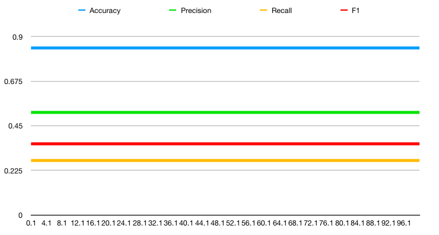

|  | 人工智能实验 |
| --------------- | ------ |
|                 |        |

##中山大学数据科学与计算机学院移动信息工程专业

##人工智能本科生实验报告

###（2017-2018学年秋季学期）
课程名称：**Artificial Intelligence**

| 教学班级 | **周五5-6** | 专业（方向） | 移动互联网 |
| ---- | --------- | ------ | ----- |
| 学号   | 15352285  | 姓名     | 任磊达   |


[TOC]

##一、 实验题目

> 感知机学习算法


##二、 实验内容

### 算法原理

感知机分类算法是一种通过对于特征的线性组合预测值而后与阈值相比较而得到结果的一种算法

其训练过程通过错误分类的样本调整某种特征线性加权权值。

```python
# parameter for data
# including bias 1
FEATURE_LEN   := 65
training_iter := 1000

# variables
w := zeros(1, FEATURE_LEN)

# training
for iter in training_iter:
  for trainx, labelx in train_data, train_label:
    Value := sum(trainx .* w)
    PredictLabel := sign(Value)
    if(PredictLabel != labelx):
      for xi in range(FEATURE_LEN):
        w(xi)` := w(xi) + labelx * trainx(xi) 
          
# predicting:
value  := sum(test .* w)
predict:= sign(value)
```

感知机

`pocket`：通过vali集合测试多个w得到最优值

```python
maxw := zeros(1, FEATURE)
maxv := 0
  
# training Framework:
for rand_i in pocket_size:
  w := rands(1, FEATURE_LEN)
  # PLA for w
  ...
  # test in validation set
  correct := 0
  for valix, valiy in Vali_data, Vali_Label :
    if sign(valix .* valix) * valiy > 0:
      correct := correct + 1
  v := accuracy(w , Vali)
  if v > maxv:
    maxw := w
    maxv := v
      
# predicting:
value  := sum(test .* maxw)
predict:= sign(value)
```

voting

求和多个模型的预测（而不是sum），而后作为预测输出，可以显著提高F1值。

### 关键代码截图

#####训练

```c++
int PLA::trainStep(double alpha)
{
    int ErrNum = 0;
    for(int i = 0; i < TrainFeature.size(); ++i)
    {
        double sum = 0;
        for(int k = 0; k < TrainFeature[i].size(); ++k)
        {
            sum += TrainFeature[i][k] * Weight[k];
        } // 加权求和，得到预测值

        if(sum * TrainLabel[i] <= 0)//省略sign函数，优化效率。
        {
            for(int k = 0; k < TrainFeature[i].size(); ++k)
            {
                Weight[k] += alpha * TrainLabel[i] * TrainFeature[i][k];
            }
            ++ErrNum;
        }// incorrect sample, update.
    }
    return ErrNum;
}
```

##### 随机初始化

```c++
void PLA::initAvgWeight()
{
    Weight.clear();
    for(int fea = 0; fea < TrainFeature[0].size(); ++fea)
    {
        double avg_sum = 0, delta_sum = 0;
        for(int data = 0; data < TrainFeature.size(); ++data)
        {
            avg_sum += TrainFeature[data][fea];
        }
        avg_sum /= TrainFeature.size();
        Weight.push_back(avg_sum + rand() * 10.0 / RAND_MAX);// 添入随机因素
    }
}
```

##### bagging方法

```c++

for(int cell = 1; cell <= 200; ++cell)
{
  initAvgWeight();
  int iter = 0, cnt_now = 0;
  double Accuracy = 0, Precision = 0,
  Recall = 0, F1 = 0;
  for(iter = 0; iter < 100; ++iter)
    trainStep(1.0);
  for(int val = 0;val < ValidFeature.size(); ++val)
  {
    double sum = 0;
    for(int k = 0; k < ValidFeature[val].size(); ++k)
    {
      sum += ValidFeature[val][k] * Weight[k];
    }
    voting_pool[val] += (sum>0)?2:-1;// 由于正样本较少，使用2提高优化率
    cnt_now += sum * ValidLabel[val] > 0;
  }

  double cnt = 0;
  int TP = 0, TN = 0, FP = 0, FN = 0;
  for(int val = 0;val < ValidLabel.size(); ++val)
  {
    if(voting_pool[val] > 0 && ValidLabel[val] > 0) TP++;
    else if(voting_pool[val] > 0 && ValidLabel[val] < 0) FP++;
    else if(voting_pool[val] < 0 && ValidLabel[val] < 0) TN++;
    else FN++;// care for zero situation.
  }
  Accuracy  = (TP + TN) * 1.0 / (TP + FP + TN + FN);
  Precision = (TP + FP) ? TP * 1.0 / (TP + FP):0;
  Recall    = (TP + FN) ? TP * 1.0 / (TP + FN):0;
  F1        = (Precision + Recall) ? 2 * Precision * Recall/(Precision + Recall):0;

  v << cell << "," 
    << cnt_now * 1.0 / ValidLabel.size() << ","
    << Accuracy << ","
    << Precision << ","
    << Recall << ","
    << F1 << ","
    << endl;
  if(Accuracy > maxAccu)
  {
    maxAccu = Accuracy;
    maxP = cell;// 记录最优bagging值
  }
}
```


### 创新点&优化

1. 设置学习率$\alpha$ (优化了bagging模型的F1值）
   $$
   w(xi)` := w(xi) + \alpha * labelx * trainx(xi)
   $$

2. 使用随机因子进行pocket

3. 对于参数更新使用dropout（对F1提升有显著效果）

4. 尝试bagging策略。


##三、 实验结果及分析

###实验结果展示示例
> 小数据测试：
>
> 由于pocket算法中填入随机因子，结果重复性较原始算法低，小数据测试仅针对原始算法。

训练集：

-4,-1,1
0,3,-1

测试集：

-2,3,?

在一次迭代后收敛（准确率为1）


###评测指标展示即分析


####迭代次数

学习率为1,最优解为**0.843**


#### pocket

迭代次数为20,随机因子设为10.0,最优解**0.85**


#### bagging数目

1. 平滑了Accu，提高模型鲁棒性。
2. pocket方法最优F1值为`0.482759`，这里dropout优化后最优为**0.496815**


#### alpha vs 迭代次数（无关）

尝试多个迭代次数，发现与alpha无关。



##四、 思考题

- 有什么其他的手段可以解决数据集非线性可分的问题？
  - 使用非线性函数
  - 利用多个特征组合生成特征
- 请查询相关资料，解释为什么要用这四种评测指标，各自的意义是什么。


| 指标        | 定义                    | 意义              |
| --------- | --------------------- | --------------- |
| Accuracy  | 判断正确测试样本/全部测试样本       | 模型测试集上正确率       |
| Precision | 判断为T的正确样本/判断为T的样本     | 评判模型对于真样本的检测准确率 |
| Recall    | 判断为T的正确样本/标签为T的样本     | 评判模型检测真样本能力     |
| F1        | Precision和Recall的调和平均 | 评价模型对正样本检测能力    |