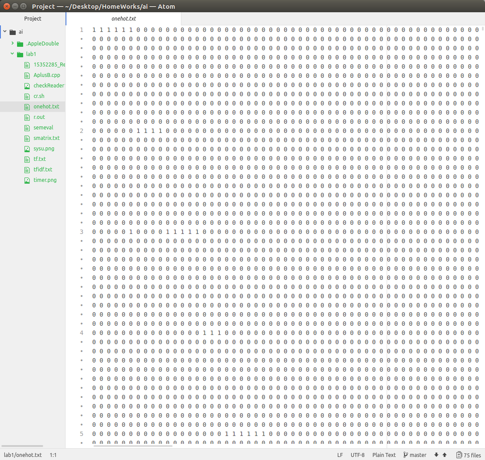
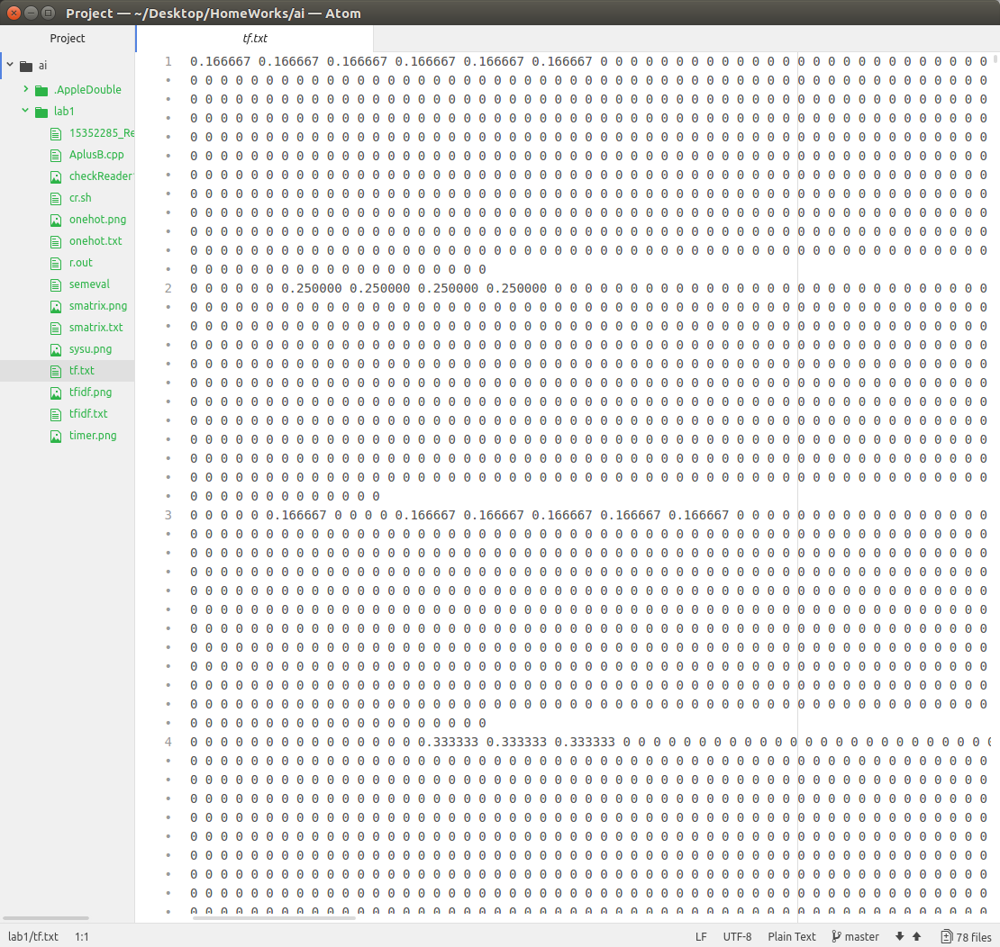
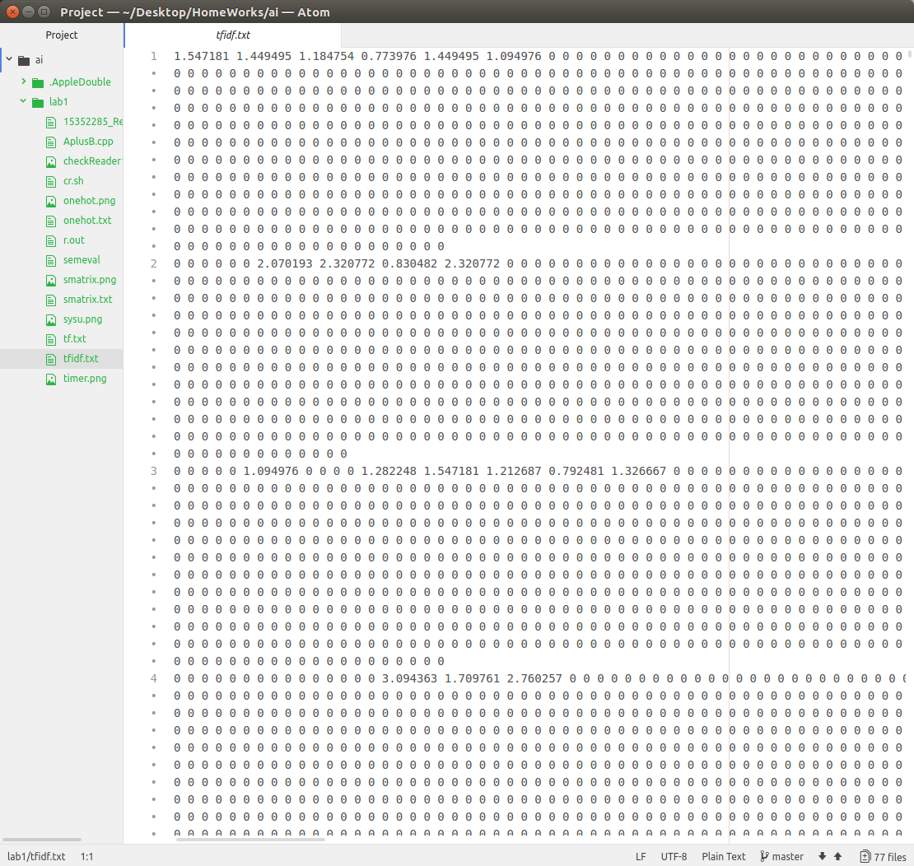
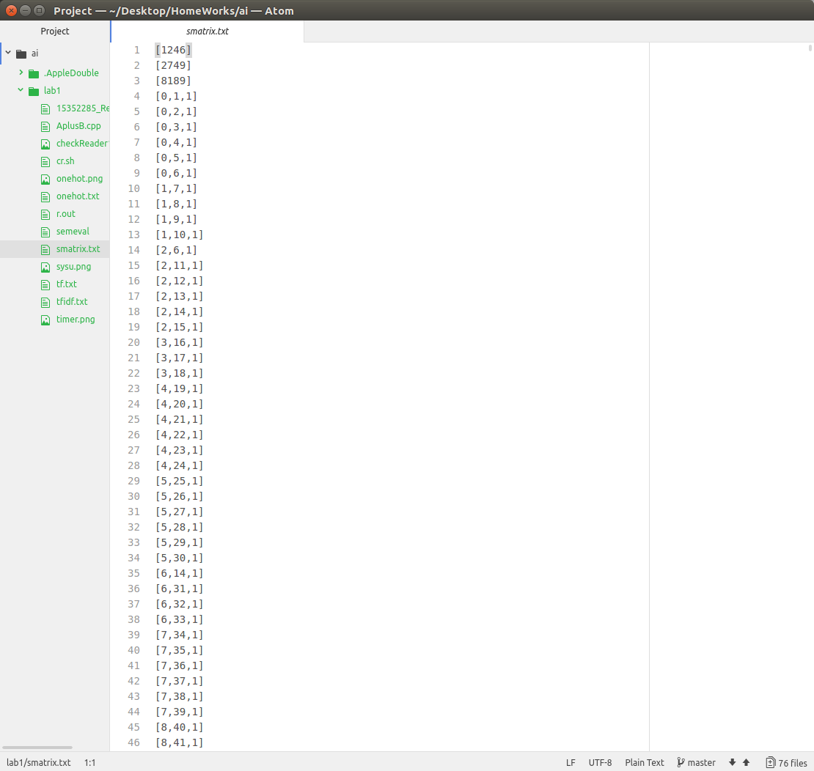
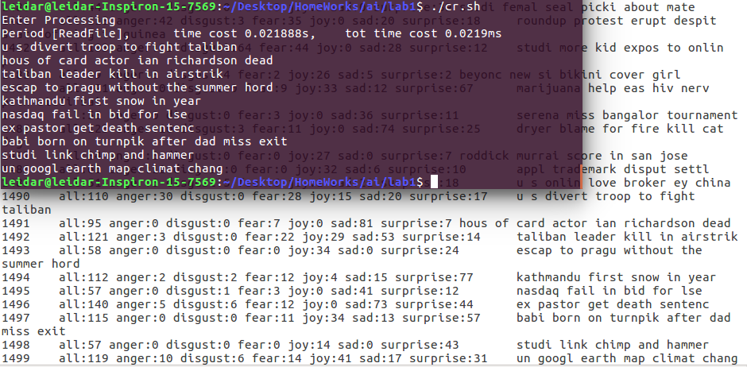
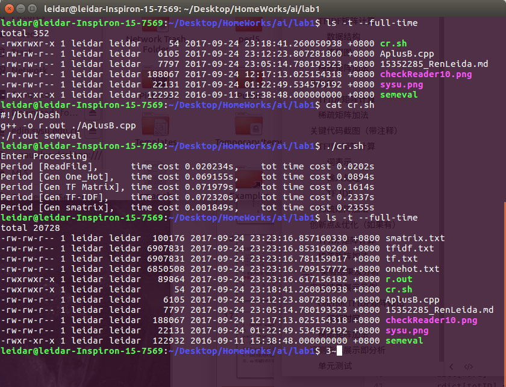
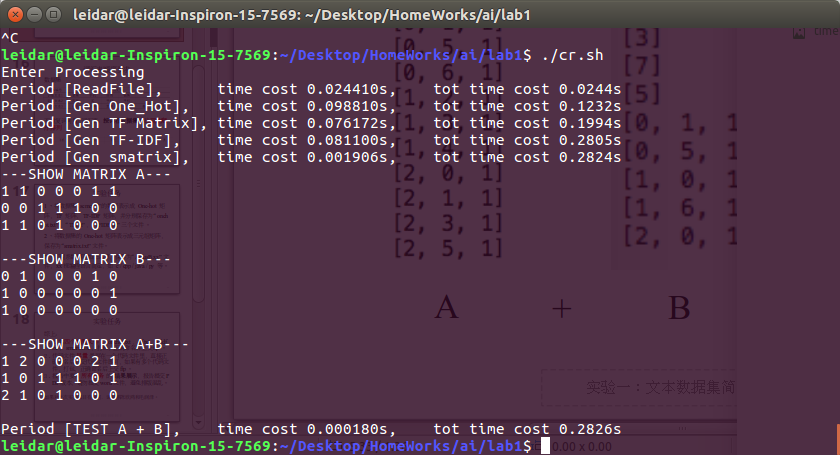
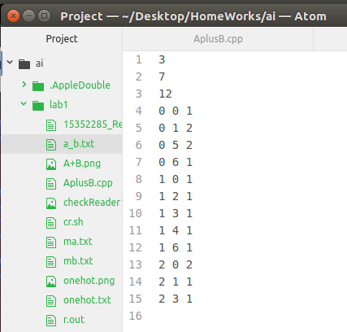

# Text2Matrix

文本数据集的简单处理(Semeval 数据集转化为onehot, tf, tf-idf)

## TFIDF

###TFIDF矩阵计算

####数据结构

- 词汇映射(map)`dict`，将每个(string)词汇映射成一个(int)ID表示。在输入时候直接处理。
  - 为了便于调试，使用一个`rdict`保存每个ID对于的词汇。
- 每个文本视作一个对象
  - (map:ID->count)`IDs`,统计每个词汇在当前文本出现的个数。=
  - (int)`totWords`统计当前文本的词的总数
  - `inline void one_hot()`输出当前文本`one hot`矩阵
  - `inline void TF()`输出当前文本的`TF`矩阵
  - `inline void addWordCount()`辅助计算IDF， 提供词汇是否在当前文本出现记录
  - `inline void TFIDF()`计算TFIDF矩阵，需要先完成IDF值计算方可以使用

### 计算流程

1. 计算所有词汇出现文本的个数
2. 通过idf公式$idf_i = log{\frac{|D|}{1+|j:t_i \in d_j}}$，计算所有词汇的idf值
3. 通过tf-idf公式$tfidf_{i,j}=tf_{i,j}*idf_i$输出TF-IDF矩阵，注意TF值为0的元素直接输出0


#### 稀疏矩阵加法

使用`map<pair<int, int> ,int>`结构存储稀疏矩阵，自然地按照行列顺序存储，这样有利于直接输出。

稀疏矩阵的加法先对第一个矩阵中的元素求和，而后补充第一个矩阵中没有的元素。

由于map使用红黑树构造，当两个矩阵大小分别为N,M时候，稀疏矩阵加法的时间复杂度为`O(NlogM + MlogN)`


计算TF-IDF矩阵和输出同时进行，节约时间和空间。

`One-hot`, `TF`矩阵计算输出类似，由于存储过程中直接使用的是` map<int, int> IDs;`于是在后文直接输出。

```c++
int wordCount[MAX_WORD];
float idf[MAX_WORD];

void genTFIDF()
{
    freopen("./tfidf.txt", "w", stdout);
    memset(wordCount, 0, sizeof(wordCount));
    for(int idx = 0; idx < row; ++idx)
    {
        r[idx].addWordCount();// 计算词出现的文本数，计算总词素
    }
    for(int w = 1; w <= totID; ++w)
    {
        idf[w] = log2f(row / (1 + wordCount[w]));// 计算idf矩阵
    }
    for(int idx = 0; idx < row; ++idx)
    {
        r[idx].TFIDF();
    }
    recoverySTDOUT();
}
```

`TFIDF`方法直接计算输出，加速输出的要点在于map对于每个值已经按照输入顺序排序，输出的时候只需要往当前位置和上一个位置之间补零，最后再补零。

```c++
inline void TFIDF()
{
  int last = 0;
  bool first = true;
  for(iter = IDs.begin(); iter != IDs.end(); ++iter)
  {
    if(first) first = false;
    else putchar(' ');// 每两个输出之间逗号隔开
    while(++last < iter->first)
    {
      putchar('0');
      putchar(' ');
    }// 补零
    printf("%f", float(iter->second) / totWords * idf[iter->first]);//输出TFIDF值
  }
  while(last++ < totID)
  {
    if(first) first = false;
    else putchar(' ');
    putchar('0');
  }//补零
  putchar('\n');
}
```


## TFIDF矩阵计算
### 数据结构

1. 计算所有词汇出现文本的个数
2. 通过idf公式$idf_i = log{\frac{|D|}{1+|j:t_i \in d_j}}$，计算所有词汇的idf值
3. 通过tf-idf公式$tfidf_{i,j}=tf_{i,j}*idf_i$输出TF-IDF矩阵，注意TF值为0的元素直接输出0

#### 计算流程

1. 遍历第一个稀疏矩阵中存储的所有位置
   - 如果在第二个矩阵中存在，求和，相加
   - 否则直接放入结果矩阵
2. 便利第二个矩阵中存储的**不在第一个矩阵中出现**的位置，放入结果矩阵
   × 如果使用hash会更优，但是hash的大小不易控制。

##### 矩阵读取

```c++
    sMatrix(const char* fileName)
    {
        freopen(fileName, "r", stdin);
        int tot, rr, cc, vv;
        scanf("%d%d%d",&r, &c, &tot);
        while(tot--)
        {
            scanf("%d%d%d",&rr, &cc, &vv);
            matrixValue[make_pair(rr, cc)] = vv; // 借助STL方便性，直接放入即可
        }
    }
```

##### 矩阵相加

```c++
sMatrix *ansMt = new sMatrix(r, c);

std::map<pair<int, int>, int> ::iterator iter = matrixValue.begin();
// 以当前矩阵为key，运算其中位置的值
for(;iter != matrixValue.end(); ++iter)
{
  if(ahs.matrixValue.count(iter->first))
  {
    ansMt->matrixValue[iter->first] = ahs.matrixValue[iter->first] + iter->second;
  }
  else
    ansMt->matrixValue[iter->first] = iter->second;
}
// 以被加矩阵为key，运算剩余的值
for(iter = ahs.matrixValue.begin(); iter != ahs.matrixValue.end(); ++iter)
{
  if(matrixValue.count(iter->first)) continue;
  ansMt->matrixValue[iter->first] = iter->second;
}
```

###实验结果展示示例

#### OneHot/TFIDF矩阵输出

生成的四个矩阵截图如下：

| One-hot             | TF                   |
| ------------------- | -------------------- |
|  |       |
| **TF-IDF**          | **smatrix**          |
|   |  |


###评测指标展示即分析

####TF-IDF
#####单元测试

- 使用最后十个数据检验输入正确性

```c++
for(int s = 0; s < 10; ++s)
{
  for(int k = 0; k < r[row - 10 + s].IDs.size(); ++k)
    printf("%s ", rdict[r[row- 10 + s].IDs[k]].c_str());
  puts("");
}
```


##### 运行时间

由于采用较多底层运算，以及较低级(`putchar()`)的输出方式，运行时间是一个很大的亮点：

运行时间保持在`0.3s`以内完成测试样例


####稀疏矩阵加法

#####运行时间展示以及矩阵效果



##### 输出稀疏矩阵



##四、 思考题

1. IDF 的第二个计算公式中分母多了个 1 是为什么？

   答：当使用测试集对于模型进行测试的时候，或者文本不同的时候，可能出现所有文本中不存在词典中某个词的情况，这时候如果用原来的idf计算公式会出现除零错误。   


2. IDF数值有什么含义？TF-IDF数值有什么含义？
   1. IDF是某词汇在文章中出现的概率的倒数大小的一种度量，IDF值越大越不易在文章中出现。
   2. TF-IDF值是某词汇在当前文章中的频率与该词IDF值的乘积，相当于使用文本库中词汇的频率来调节每个词在当前文本中出现的频率。比如一个词在当前文本中出现一次，TF值为1/4，如果只用TF值是一个很普通的值，但是IDF值高，也就是该词汇在整个文本库中很罕见的时候，该词是一个罕见词，在搜索引擎搜索时候该词更应该被作为特征被表示出来，TFIDF值更有特征的表示了该值的重要程度。


3. 为什么要用三元顺序表表达稀疏矩阵？

4. 三元顺序表是洗漱矩阵信息的最小存储手段之一。
  - 稀疏矩阵中非零元素少，可以通过存储较少的非零元素存储稀疏矩阵的值
  - 当非零元素数目少的时候，三元顺序表的增删查改效率非常高。
5. 三元顺序表可以进行基本的矩阵运算。
  - 根据矩阵的分块原理，矩阵的加减乘除等于分块之后四个矩阵的对应操作。
  - 三元顺序表可以提高基本运算的效率。

